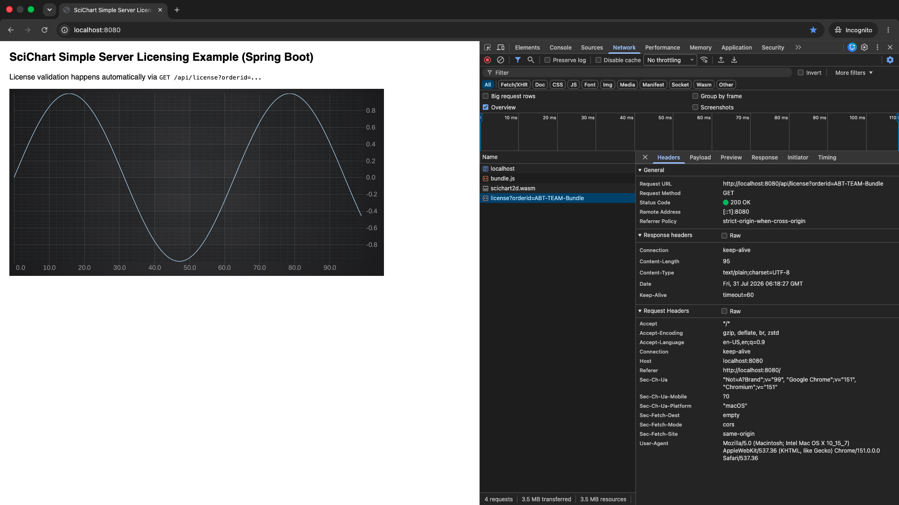

# Simple Server Licensing Example (Spring Boot)

Demonstrates SciChart's **Simple Server Validation v2** flow — server-side license validation using only HMAC-SHA256, with no native library and no JNI. The entire server-side change is a single `@RestController` using `javax.crypto.Mac` from the JDK.

## How it works

A v2 token can take one of two shapes on the wire:

- **Inline** (4 fields) — `v2:serverNonce:serverNow:hmac`. Independent of any client state; servable to many clients and embeddable in HTML via a `<meta>` tag. Should still be signed per request — the embedded `serverNow` ages relative to the client's clock and will fall outside `max_skew` once the token is older than the licence's tolerance, so caching past that point causes valid clients to reject otherwise-correct tokens.
- **Round-trip** (5 fields) — `v2:clientNonce:serverNonce:serverNow:hmac`. The client generates a random nonce in WASM and sends it as `?nonce=<hex>`; the server echoes it into the signed token. A captured response is bound to the requesting client and cannot be replayed on another origin.

For most deployments the two shapes are interchangeable under a single licence — mix inline meta-tag delivery and round-trip requests freely, the SciChart client accepts whichever arrives. Deployments that can't keep server and client clocks in reasonable alignment should be locked to round-trip only: inline tokens can drift stale, round-trip tokens are signed against the request that produced them.

The fourth field of `SV:H:V:N` chooses: `0` (permissive default) accepts both shapes; `1` (restricted) accepts round-trip only and disables inline delivery.

This example's server handles both shapes from one endpoint; the licence on the client side decides what it accepts.

```
Browser (SciChart.js)
  → GET /api/license?orderid=<X>[&nonce=<hex>]    (nonce only when validate_nonce=1)
  ← 200 OK  body: v2:[clientNonce:]serverNonce:serverNow:hmac

SciChart WASM verifies HMAC, checks clock skew against the licence's
max_skew, enforces server-time monotonicity across re-validations,
and caches the result in a cookie until valid_time has elapsed.
```

### Client/server interaction

1. `SciChartSurface.create()` boots the WASM, which reads the `SV:H:V:N` feature from the runtime licence key.
2. The WASM checks the `scLicense` cookie. Still valid → it stops here and **no request is made**.
3. Otherwise, in round-trip mode it generates a client nonce, then calls `GET /api/license?orderid=<X>[&nonce=<hex>]`.
4. The server signs a fresh token and returns it. It keeps no state, doesn't read the cookie, and ignores `orderid` — a multi-licence deployment would use `orderid` to pick which secret to sign with.
5. The WASM verifies the HMAC, the clock skew against `max_skew`, that `serverNow` hasn't moved backwards since the last validation, and (round-trip) that its own nonce came back unchanged.
6. On success it writes `scLicense` — licence key, accepted token, expiry, validation time — and renders without a watermark.

The server only *issues* tokens; every check happens client-side and the result never comes back. A successful issue is not proof the client accepted it, so treat the browser console as the real verdict. Because of step 2 you will not see a request on every page load — once cached, the client stays quiet until `valid_time` elapses.

## Prerequisites

- JDK 17+
- Spring Boot 3 (pulled in by Maven, nothing to install)
- Maven 3.9+
- Node.js 18+ (for building the client bundle)
- A SciChart license with the `SV:H:V:N` feature flag, where:

  - `max_skew` — accepted client/server clock skew as `H` or `H.MM` (e.g. `0.05` = 5 min, `1` = 1 h, `1.30` = 90 min). `0` disables the check.
  - `valid_time` — token validity in the client's wall clock, same `H.MM` format (e.g. `168` = 7 days, `0.30` = 30 min)
  - `validate_nonce` — `0` accepts either shape (permissive default); `1` restricts to round-trip only (inline delivery disabled)

  Contact [support@scichart.com](mailto:support@scichart.com) to have an SV v2 feature added to your license.

On macOS, install the JDK and Maven with Homebrew, then link the JDK so the system `java` picks it up:

```bash
brew install openjdk@17 maven
sudo ln -sfn /opt/homebrew/opt/openjdk@17/libexec/openjdk.jdk \
  /Library/Java/JavaVirtualMachines/openjdk-17.jdk
```

Check with `java -version` (should report 17 or later) and `mvn -v`.

## Setup

1. **Get your Server Secret**
   Log in to [SciChart MyAccount](https://www.scichart.com/my-account/) and open **Orders & Keys → Manage Licenses → Runtime License Key**. Copy the **Server Secret** (a 64-char hex string) from the _Server Secret_ section. Only present if your license carries the Simple Server Validation (`SV`) feature.

2. **Set the Server Secret**
   Edit `src/main/java/com/example/scichart/LicenseController.java` and replace `SCICHART_SERVER_SECRET` with your Server Secret. In production, prefer externalising this via `application.properties`:

   ```properties
   scichart.server-secret=<your 64-char hex Server Secret>
   ```

   Then inject it with `@Value("${scichart.server-secret}")`.

3. **Set the client license key**
   Edit `client/index.ts` and replace the key passed to `setRuntimeLicenseKey` with your full license key string. The key must carry an `SV:H:V:N` feature.

4. **Build the client bundle**

   ```bash
   npm install
   npm run build
   ```

   This writes `bundle.js` and the SciChart WASM files into `src/main/resources/static/`, where Spring Boot serves them automatically.

5. **Run the server**

   ```bash
   mvn spring-boot:run
   ```

   Open http://localhost:8080 — the chart should render without a watermark. The port is set by `server.port` in `src/main/resources/application.properties`; override it per run with `mvn spring-boot:run -Dspring-boot.run.arguments=--server.port=9090`.

   Or package a standalone jar and run that:

   ```bash
   mvn clean package
   java -jar target/scichart-spring-simple-server-licensing-1.0.0.jar
   ```

   Stop the server with `Ctrl+C`. Re-run `npm run build` after any change to `client/index.ts`; changes to the Java sources need a restart.

## Verification

- Open browser DevTools → Network. Look for `GET /api/license?orderid=...` returning `200`. When the licence has validate_nonce=1 the URL also has `&nonce=<hex>`.
- In Application → Cookies, you should see `scLicense` set with a future expiry.
- The console should log `Simple server license validated`.
- The server logs a line per issued token, e.g. `License token issued (inline) to 0:0:0:0:0:0:0:1: serverNonce=... serverNow=...`.



A successful run: the chart renders without a watermark and `GET /api/license?orderid=ABT-TEAM-Bundle` returns `200 OK`. The 95-byte response is an inline token — `v2:` + 16-char serverNonce + 10-digit serverNow + 64-char hmac + 2 separators — and the absence of `&nonce=` in the URL means this licence has `validate_nonce=0`.

Use a private/incognito window, as shown, or clear the `scLicense` cookie first. On a normal reload the cached cookie suppresses the request entirely and you'll see neither the network call nor the server log.

## Token format

Inline shape (4 colon-separated fields):

```
v2:<serverNonce>:<serverNow>:<hmac>
```

Round-trip shape (5 colon-separated fields):

```
v2:<clientNonce>:<serverNonce>:<serverNow>:<hmac>
```

- `serverNonce` — server-generated random hex (≥ 16 chars)
- `serverNow` — server wall-clock Unix timestamp, decimal seconds
- `clientNonce` (round-trip only) — verbatim echo of the request's `?nonce=` value
- `hmac` — `HMAC-SHA256(serverSecret, payload)` where the payload is everything before the final colon

## Server snippets for other languages

See [../SimpleServerSideLicensing-Readme.md](../SimpleServerSideLicensing-Readme.md) for Python, Go, Ruby, PHP, and Rust snippets.

> **Key point in all cases:** `HexFormat.of().parseHex()` decodes the Server Secret to binary bytes before it is passed to HMAC. Do not use the hex string directly as the key.

> **Inline-mode caching:** not recommended. Inline tokens are not bound to a particular client, but the embedded `serverNow` ages relative to the client's clock and will fall outside `max_skew` once the cache is older than the licence's tolerance — sign per request. Round-trip responses cannot be cached either.

## Differences from Advanced Server Licensing

|                             | Simple (this example)                | Advanced                            |
| --------------------------- | ------------------------------------ | ----------------------------------- |
| Server dependency           | None (JDK `javax.crypto`)            | Native library + JNI                |
| Crypto                      | Symmetric HMAC-SHA256                | Asymmetric NaCl box                 |
| Token validity              | Per-licence (`valid_time`)           | 7 days, daily re-validation         |
| Cross-origin replay defence | Round-trip shape + client nonce      | Encrypted challenge enforces domain |
| Clock-skew tolerance        | Per-licence (`max_skew`, 0 disables) | Anchored on client time             |
| Required feature flag       | `SV:H:V:N`                           | none                                |
