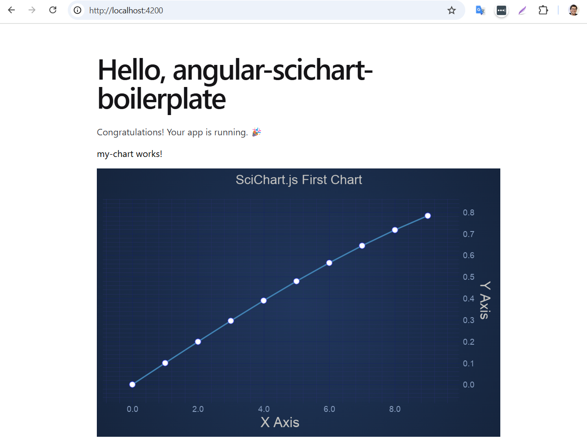

# Angular SciChart Boilerplate

This boilerplate uses Angular 20 and SciChart.js 5.0.



**Run in dev mode**

```
npm install
npm start
```

**Build for production**

```
npm run build
```

## Steps to create it from scratch

### Step 0: Create a Project

Open your existing project or generate a new one using Angular CLI

`npx ng new angular-scichart-boilerplate`

### Step 1: Add SciChart to your Angular Application

```bash
npm install scichart
```

### Step 2: Set up wasm file deployment

SciChart.js uses WebAssembly files which must be served. The easiest way to do this is to copy the wasm files from the `node_modules/scichart/_wasm folder` to your output folder.

This can be done by modifying `angular.json` file

```json
"assets": [
    {
        "glob": "scichart2d.wasm",
        "input": "./node_modules/scichart/_wasm/",
        "output": "."
    },
    {
        "glob": "scichart2d-nosimd.wasm",
        "input": "./node_modules/scichart/_wasm/",
        "output": "."
    }
],
```

> Note: other methods to [load wasm from CDN](https://www.scichart.com/documentation/js/v5/2d-charts/surface/deploying-wasm/) are available to simplify getting started

### Step 3: Create a chart component

`ng generate component my-chart`

### Step 4: Creating initSciChart() function

Next, create a function to initialize a SciChartSurface like this:

```typescript
import { SciChartSurface, NumericAxis, FastLineRenderableSeries, XyDataSeries, EllipsePointMarker, SweepAnimation, SciChartJsNavyTheme, NumberRange, MouseWheelZoomModifier, ZoomPanModifier, ZoomExtentsModifier } from "scichart";

async function initSciChart() {
  // Initialize SciChartSurface. Don't forget to await!
  const { sciChartSurface, wasmContext } = await SciChartSurface.create("scichart-root", {
    theme: new SciChartJsNavyTheme(),
    title: "SciChart.js First Chart",
    titleStyle: { fontSize: 22 },
  });

  // Create an XAxis and YAxis with growBy padding
  const growBy = new NumberRange(0.1, 0.1);
  sciChartSurface.xAxes.add(new NumericAxis(wasmContext, { axisTitle: "X Axis", growBy }));
  sciChartSurface.yAxes.add(new NumericAxis(wasmContext, { axisTitle: "Y Axis", growBy }));

  // Create a line series with some initial data
  sciChartSurface.renderableSeries.add(
    new FastLineRenderableSeries(wasmContext, {
      stroke: "steelblue",
      strokeThickness: 3,
      dataSeries: new XyDataSeries(wasmContext, {
        xValues: [0, 1, 2, 3, 4, 5, 6, 7, 8, 9],
        yValues: [0, 0.0998, 0.1986, 0.2955, 0.3894, 0.4794, 0.5646, 0.6442, 0.7173, 0.7833],
      }),
      pointMarker: new EllipsePointMarker(wasmContext, { width: 11, height: 11, fill: "#fff" }),
      animation: new SweepAnimation({ duration: 300, fadeEffect: true }),
    })
  );

  // Add some interaction modifiers to show zooming and panning
  sciChartSurface.chartModifiers.add(new MouseWheelZoomModifier(), new ZoomPanModifier(), new ZoomExtentsModifier());

  return sciChartSurface;
}
```

### Step 5: Use initSciChart() in the component

```typescript
export class MyChart implements OnInit, OnDestroy {
  chartInitializationPromise: Promise<SciChartSurface> | undefined;

  ngOnInit(): void {
    this.cleanupSciChart();
    this.chartInitializationPromise = initSciChart();
  }

  ngOnDestroy() {
    this.cleanupSciChart();
  }

  cleanupSciChart() {
    if (this.chartInitializationPromise) {
      // Delete the chart from the DOM, and dispose of SciChart
      this.chartInitializationPromise.then((sciChartSurface) => {
        sciChartSurface.delete();
      });
      this.chartInitializationPromise = undefined;
    }
  }
}
```

## SciChart.js Tutorials and Getting Started

We have a wealth of information on our site showing how to get started with SciChart.js!

Take a look at:

- [Getting-Started with SciChart.js](https://www.scichart.com/getting-started-scichart-js): includes trial licensing, first steps and more
- [SciChart.js Documentation](www.scichart.com/javascript-chart-documentation): user manual, tutorials, API documentation
- [Official scichart.js demos](https://scichart.com/demo/): view our demos online! Full github source code also available at [github.com/ABTSoftware/SciChart.JS.Examples](https://github.com/ABTSoftware/SciChart.JS.Examples)
