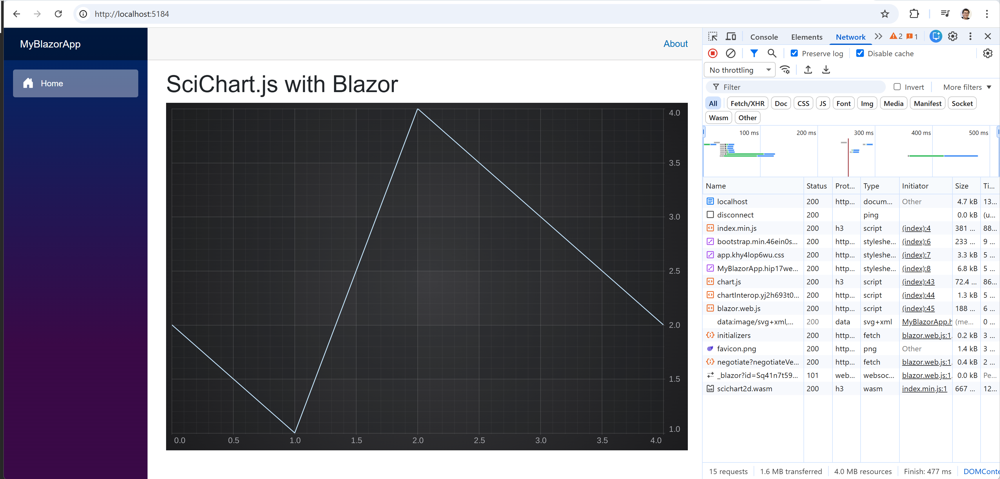

# SciChart.Blazor

## Running the SciChart.js Blazor Boilerplate

- Run `dotnet run` in a terminal
- Open browser http://localhost:5184



## How to create a Blazor app

This app was created using this steps:

1. Install .NET SDK (LTS recommended). Download from: https://dotnet.microsoft.com/download and verify version `dotnet --version`
2. Create a new Blazor project `dotnet new blazor -n MyBlazorApp`
3. Run it

```
cd MyBlazorApp
dotnet run
```

# Blazor JavaScript Interop

To interop with JS we updated `Components\Pages\Home.razor` page and created `wwwroot\chartInterop.js` file.

**Home.razor**

```
@page "/"
@rendermode InteractiveServer
@inject IJSRuntime JS

<PageTitle>SciChart.js with Blazor</PageTitle>

<h1>SciChart.js with Blazor</h1>

<div id="myChart" style="width: 900px; height:600px"></div>

@code {
    protected override async Task OnAfterRenderAsync(bool firstRender)
    {
        if (firstRender)
        {
            await JS.InvokeVoidAsync(
                "renderChart",
                "myChart",
                new[] { 0, 1, 2, 3, 4 },
                new[] { 2, 1, 4, 3, 2 }
            );
        }
    }

    protected override void OnInitialized()
    {
        Console.WriteLine("Initialized");
    }
}
```

**chartInterop.js**

```js
window.renderChart = (chartRootDiv, xValues, yValues) => {
  initSciChart(chartRootDiv, xValues, yValues);
};

async function initSciChart(chartRootDiv, xValues, yValues) {
  const {
    SciChartSurface,
    NumericAxis,
    FastLineRenderableSeries,
    XyDataSeries,
  } = SciChart;
  // Create the SciChartSurface in chartRootDiv
  const { sciChartSurface, wasmContext } = await SciChartSurface.create(
    chartRootDiv
  );

  // Create an X,Y Axis and add to the chart
  const xAxis = new NumericAxis(wasmContext);
  const yAxis = new NumericAxis(wasmContext);

  sciChartSurface.xAxes.add(xAxis);
  sciChartSurface.yAxes.add(yAxis);

  // Add a series
  sciChartSurface.renderableSeries.add(
    new FastLineRenderableSeries(wasmContext, {
      dataSeries: new XyDataSeries(wasmContext, {
        xValues,
        yValues,
      }),
    })
  );
}
```

Finally we added script to load scichart.js from CDN into `App.razor`.

```html
<script
  src="https://cdn.jsdelivr.net/npm/scichart@5.0.0-alpha.135/index.min.js"
  crossorigin="anonymous"
></script>
```

## SciChart.js Tutorials and Getting Started

We have a wealth of information on our site showing how to get started with SciChart.js!

Take a look at:

- [Getting-Started with SciChart.js](https://www.scichart.com/getting-started-scichart-js): includes trial licensing, first steps and more
- [SciChart.js Documentation](www.scichart.com/javascript-chart-documentation): user manual, tutorials, API documentation
- [Official scichart.js demos](https://www.scichart.com/demo/): view our demos online! Full github source code also available at [github.com/ABTSoftware/SciChart.JS.Examples](https://github.com/ABTSoftware/SciChart.JS.Examples)
