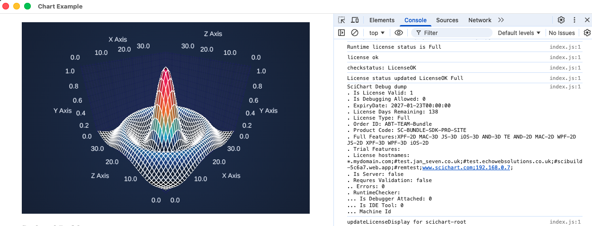

# SciChart.js Electron, Typescript, Webpack Boilerplate example

This example was generated using [Electron Forge](https://www.electronjs.org/blog/forge-v6-release#what-is-electron-forge) from TS + webpack boilerplate

## Licensing

SciChart.js is commercial software with a [free community license](https://scichart.com/community-licensing).

- From SciChart.js v3.2 and onwards, trial licenses are not required. Instead the chart initialises with a [Community License](https://scichart.com/community-licensing)
- For commercial licensing, follow steps from [scichart.com/licensing-scichart-js](https://scichart.com/licensing-scichart-js).

## Step 1: Adding SciChart to your Electron Application

If you haven't already done so, add SciChart.js to your Electron application

```javascript
npm install scichart
```

## Step 2: Wasm file deployment

SciChart.js uses WebAssembly files which must be served. The easiest way to do this is to copy the wasm files from the node_modules/scichart/\_wasm folder to your output folder.

e.g. with webpack.config.js:

```
 plugins: [
    new CopyPlugin({
      patterns: [
        { from: "src/index.html", to: "" },
        { from: "node_modules/scichart/_wasm/scichart2d.wasm", to: "" },
        { from: "node_modules/scichart/_wasm/scichart2d-nosimd.wasm", to: "" },
      ],
    })
  ],
```

> Note: other methods to [load wasm from CDN](https://www.scichart.com/documentation/js/v5/2d-charts/surface/deploying-wasm/) are available to simplify getting started

## Step 3: Creating the Chart

After that, you can create a function to create a SciChartSurface like this.

```javascript
import {
  SciChartSurface,
  NumericAxis,
  FastLineRenderableSeries,
  XyDataSeries,
  EllipsePointMarker,
  SweepAnimation,
  SciChartJsNavyTheme,
  NumberRange,
  MouseWheelZoomModifier,
  ZoomPanModifier,
  ZoomExtentsModifier,
} from "scichart";

async function initSciChart() {
  // LICENSING
  // Commercial licenses set your license code here
  // Purchased license keys can be viewed at https://www.scichart.com/profile
  // How-to steps at https://www.scichart.com/licensing-scichart-js/
  // SciChartSurface.setRuntimeLicenseKey("YOUR_RUNTIME_KEY");

  // Initialize SciChartSurface. Don't forget to await!
  // Expects <div id="scichart-root"></div> in the DOM
  const { sciChartSurface, wasmContext } = await SciChartSurface.create(
    "scichart-root",
    {
      theme: new SciChartJsNavyTheme(),
      title: "SciChart.js First Chart",
      titleStyle: { fontSize: 22 },
    }
  );

  // Create an XAxis and YAxis with growBy padding
  const growBy = new NumberRange(0.1, 0.1);
  sciChartSurface.xAxes.add(
    new NumericAxis(wasmContext, { axisTitle: "X Axis", growBy })
  );
  sciChartSurface.yAxes.add(
    new NumericAxis(wasmContext, { axisTitle: "Y Axis", growBy })
  );

  // Create a line series with some initial data
  sciChartSurface.renderableSeries.add(
    new FastLineRenderableSeries(wasmContext, {
      stroke: "steelblue",
      strokeThickness: 3,
      dataSeries: new XyDataSeries(wasmContext, {
        xValues: [0, 1, 2, 3, 4, 5, 6, 7, 8, 9],
        yValues: [
          0, 0.0998, 0.1986, 0.2955, 0.3894, 0.4794, 0.5646, 0.6442, 0.7173,
          0.7833,
        ],
      }),
      pointMarker: new EllipsePointMarker(wasmContext, {
        width: 11,
        height: 11,
        fill: "#fff",
      }),
      animation: new SweepAnimation({ duration: 300, fadeEffect: true }),
    })
  );

  // Add some interaction modifiers to show zooming and panning
  sciChartSurface.chartModifiers.add(
    new MouseWheelZoomModifier(),
    new ZoomPanModifier(),
    new ZoomExtentsModifier()
  );

  return sciChartSurface;
}

// Note: When using SciChart.js in React, Angular, Vue use component lifecycle to delete the chart on unmount
// for examples see the Vue/React/Angular boilerplates at https://www.scichart.com/getting-started/scichart-javascript/
initSciChart();
```

### Recommendation: use React, Vue or Angular

> In this example to keep it simple we just use a single JS file and Electron.
> The JS file is included in `renderer.ts`. In practice,
> we recommend using React or similar and obeying component lifecycle to delete
> the chart on unmount. For more info, see the React, Vue or Angular boilerplate demos at [scichart.com/getting-started-scichart-js](https://scichart.com/getting-started-scichart-js)

## Running the example

> npm install
> npm start

# Notes on Commercial Licensing

You will need to have the **[SciChart Licensing Wizard](https://www.scichart.com/licensing-scichart-js/)** running with a trial or activated commercial license.

**\_NOTE** you may need to configure the security policy in dev mode to allow connection with the Licensing Wizard\_

```javascript
devContentSecurityPolicy: "connect-src 'self' * 'unsafe-eval'";
```

### Runtime Licensing for Electron

A runtime license key only applies in production mode, where the mainWindow content is loaded from a file (`file://`) rather than from a server. In dev mode (`npm start`) the renderer is served by the webpack dev server at `http://localhost:3000`, so the key is checked against the hostname `localhost` instead.

To run this example in production mode:

> npm run package

then launch the packaged app from the `out/` directory.

The runtime license key must be set in `BoilerPlates/electron/src/chartInit2D.js`:

```javascript
SciChartSurface.setRuntimeLicenseKey("YOUR_RUNTIME_KEY");
```

When the key is applied correctly, the packaged app renders the chart and the console reports `checkstatus: LicenseOK` with `License Type: Full` and an empty `Machine Id` (there is no hostname when loading from a file):



#### Debugging the license

The output above is not printed by default. To enable it, run this in the DevTools console and reload:

```javascript
localStorage.setItem("LICENSE_DEBUG", "1");
location.reload();
```

SciChart then logs every step it takes when applying the license, ending with either `checkstatus: LicenseOK` or the reason it was rejected, followed by the `SciChart Debug dump`.

Two things to note:

- This example opens DevTools automatically in both dev and packaged builds (`mainWindow.webContents.openDevTools()` in `src/index.ts`).
- `file://` and `http://localhost:3000` are separate storage origins, so the flag does not carry over between the packaged app and dev mode. Set it in whichever one you are debugging.

To turn it off again:

```javascript
localStorage.removeItem("LICENSE_DEBUG");
```
