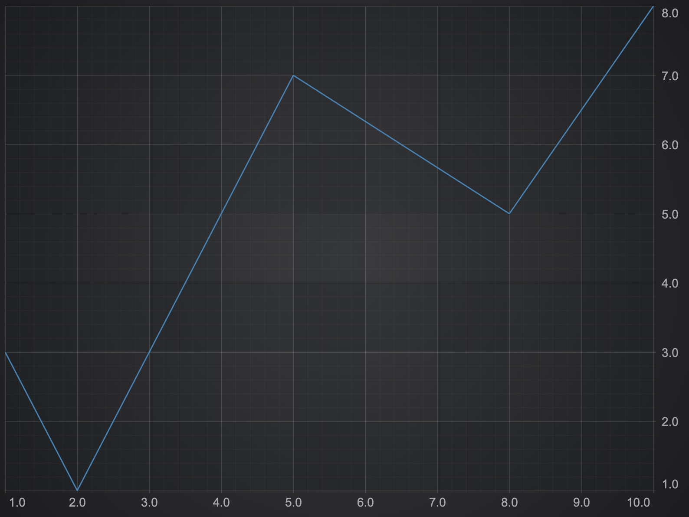

# Simple Chart with Webpack and NPM

This is the simplest project using SciChart.js as npm module and Webpack.

## Licensing

SciChart.js is commercial software with a [free community license](https://scichart.com/community-licensing).

- From SciChart.js v3.2 and onwards, trial licenses are not required. Instead the chart initialises with a [Community License](https://scichart.com/community-licensing)
- For commercial licensing, follow steps from [scichart.com/licensing-scichart-js](https://scichart.com/licensing-scichart-js).

## How to run the project

- `npm install`
- `npm start`



## Description

### webpack.config.js

Use CopyPlugin to copy wasm and data files and serve them by webpack-dev-server. SciChart.js uses WebAssembly and those files **scichart2d.data**, **scichart2d.wasm** must be loaded.

```javascript
const path = require("path");
const CopyPlugin = require("copy-webpack-plugin");

module.exports = {
  mode: "development",
  entry: "./src/index.js",
  performance: {
    hints: false,
  },
  output: {
    path: path.resolve(__dirname, "build"),
    filename: "bundle.js",
  },
  plugins: [
    new CopyPlugin({
      patterns: [
        { from: "src/index.html", to: "" },
        { from: "node_modules/scichart/_wasm/scichart2d.data", to: "" },
        { from: "node_modules/scichart/_wasm/scichart2d.wasm", to: "" },
      ],
    }),
  ],
};
```

### SciChartSurface.configure

You may need this to configure from where wasm and data files are served, update `src/index.js` file if needed

```javascript
import { SciChartSurface } from "scichart/Charting/Visuals/SciChartSurface";

// call this before SciChartSurface.create()
SciChart.SciChartSurface.configure({
  dataUrl: "/custom/scichart2d.data",
  wasmUrl: "/other/scichart2d.wasm",
});
```

### Chart div element

If you call `SciChartSurface.create("scichart-root")` an element with Id "scichart-root" must be present.

```html
<html lang="en-us">
  <head>
    <meta charset="utf-8" />
    <meta content="text/html; charset=utf-8" http-equiv="Content-Type" />
    <title>SciChart.js Tutorial 1</title>
    <script async type="text/javascript" src="bundle.js"></script>
  </head>
  <body>
    <!-- the Div where the SciChartSurface will reside -->
    <div id="scichart-root" style="width: 800px; height: 600px;"></div>
  </body>
</html>
```

# SciChart.js Tutorials and Getting Started

We have a wealth of information on our site showing how to get started with SciChart.js!

Take a look at:

- [Getting-Started with SciChart.js](https://www.scichart.com/getting-started-scichart-js): includes trial licensing, first steps and more
- [Javascript / npm tutorials](https://www.scichart.com/documentation/js/current/Tutorial%2002%20-%20Adding%20Series%20and%20Data.html): using npm, webpack, and scichart.js, create static and dynamic charts with zooming, panning tooltips and more
- [Vanilla Javascript tutorials](https://www.scichart.com/documentation/js/current/Tutorial%2001%20-%20Including%20SciChart.js%20in%20an%20HTML%20Page.html): using only vanilla javascript and HTML,
- [Official scichart.js demos](https://demo.scichart.com): view our demos online! Full github source code also available at [github.com/abtsoftware/scichart.js.examples](https://github.com/abtsoftware/scichart.js.examples)
