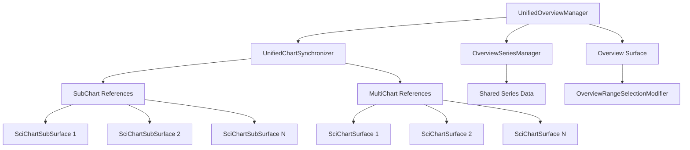

# Unified Overview SubChart API

This implementation provides a unified API that supports both SubCharts and MultiCharts with a single overview interface

The unified overview API successfully bridges the gap between SciChart's SubChart and MultiChart architectures, providing a seamless developer experience regardless of the underlying chart implementation.

## Architecture Overview



## Key Components

### 1. UnifiedOverviewManager
The main orchestrator that coordinates all overview functionality:

```typescript
import { createUnifiedOverview, IUnifiedOverviewConfig } from './LayoutManager/unifiedOverviewAPI';

const overviewManager = createUnifiedOverview({
    theme: appTheme.SciChartJsTheme,
    initialVisibleRange: new NumberRange(200, 800),
    enableRangeSelection: true,
    showAxisLabels: true,
});

// Create overview surface
await overviewManager.createOverview('overview-div-id');

// Add SubCharts
overviewManager.addSubChart('subchart1', subChartSurface);

// Add MultiCharts  
overviewManager.addMultiChart('multichart1', independentSurface);
```

### 2. UnifiedChartSynchronizer
Handles synchronization between different chart types:

```typescript
// Automatically synchronizes visible ranges across all chart types
// Supports both SubChart and MultiChart architectures
// Provides event-driven updates with debouncing
```

### 3. OverviewSeriesManager
Manages series representation in the overview:

```typescript
// Clones series configurations while sharing data references
// Automatically handles series addition/removal
// Optimizes performance through shared data
```

## Implementation Files

### Core API Files
- **`unifiedOverviewAPI.ts`** - Main API implementation with all core classes
- **`enhancedPaneManager.ts`** - Enhanced pane manager with overview integration
- **`enhancedDrawExample.ts`** - Enhanced draw example with overview support

### Demo and Examples
- **`unifiedOverviewDemo.ts`** - Comprehensive demo showing both SubCharts and MultiCharts
- **`unifiedOverviewExample.tsx`** - React component demonstrating the unified API
- **`README.md`** - This documentation file

## Usage Examples

### Basic Usage with SubCharts

```typescript
import { createUnifiedOverview } from './LayoutManager/unifiedOverviewAPI';
import { EnhancedPaneManager } from './LayoutManager/enhancedPaneManager';

// Create overview manager
const overviewManager = createUnifiedOverview();
await overviewManager.createOverview('overview-div');

// Use with existing SubChart implementation
const enhancedPaneManager = new EnhancedPaneManager(container, surface, wasmContext);
await enhancedPaneManager.initialize({
    overview: {
        enabled: true,
        divId: 'overview-div'
    }
});
```

### Basic Usage with MultiCharts

```typescript
// Create independent chart surfaces
const chart1 = await SciChartSurface.create('chart1-div');
const chart2 = await SciChartSurface.create('chart2-div');

// Add to unified overview
overviewManager.addMultiChart('chart1', chart1);
overviewManager.addMultiChart('chart2', chart2);

// All charts now synchronized through overview
```

### Mixed Usage (SubCharts + MultiCharts)

```typescript
// Add SubCharts
parentSurface.subCharts.forEach((subChart, index) => {
    overviewManager.addSubChart(`subchart_${index}`, subChart);
});

// Add MultiCharts
independentSurfaces.forEach((surface, index) => {
    overviewManager.addMultiChart(`multichart_${index}`, surface);
});

// All charts synchronized regardless of type!
```

## Key Features

### ✅ Unified Interface
- Single API works with both SubCharts and MultiCharts
- Consistent method signatures across chart types
- Transparent handling of different architectures

### ✅ Efficient Synchronization
- Event-driven synchronization with debouncing
- Prevents circular updates during range changes
- Supports selective chart activation/deactivation

### ✅ Performance Optimized
- Shared data references between original and overview series
- Minimal overhead for chart type abstraction
- Efficient series cloning without data duplication

### ✅ Flexible Configuration
- Configurable overview appearance and behavior
- Support for custom themes and styling
- Optional range selection and axis labels

### ✅ Easy Integration
- Drop-in replacement for existing implementations
- Backward compatibility with current APIs
- Progressive enhancement approach

## Configuration Options

```typescript
interface IUnifiedOverviewConfig {
    theme?: any;                          // SciChart theme
    initialVisibleRange?: NumberRange;    // Starting visible range
    enableRangeSelection?: boolean;       // Enable range selection modifier
    showAxisLabels?: boolean;             // Show axis labels on overview
    autoRange?: EAutoRange;               // Auto-ranging behavior
    growBy?: NumberRange;                 // Axis growth margins
}
```

## Enhanced Pane Management Configuration

```typescript
interface IEnhancedPaneManagementConfig extends IPaneManagementConfig {
    overview?: {
        enabled?: boolean;                // Enable overview functionality
        divId?: string;                   // Overview container div ID
        config?: IUnifiedOverviewConfig; // Overview configuration
    };
}
```

## API Methods

### UnifiedOverviewManager Methods

```typescript
// Overview creation
createOverview(divId: string): Promise<SciChartSurface>

// Chart management
addSubChart(chartId: string, subChart: SciChartSubSurface): void
addMultiChart(chartId: string, surface: SciChartSurface): void
removeChart(chartId: string): void

// Synchronization control
setVisibleRange(range: NumberRange): void
getVisibleRange(): NumberRange | null
setChartSyncEnabled(chartId: string, enabled: boolean): void

// Access and cleanup
getCharts(): Map<string, IChartReference>
getOverviewSurface(): SciChartSurface | null
cleanup(): void
```

### EnhancedPaneManager Methods

```typescript
// All original PaneManager methods plus:
getOverviewManager(): UnifiedOverviewManager | null
isOverviewEnabled(): boolean
setVisibleRange(range: NumberRange): void
getVisibleRange(): NumberRange | null
```

## Benefits

### For Developers
1. **Single Learning Curve** - Learn one API that works with both architectures
2. **Consistent Experience** - Same methods work regardless of chart type
3. **Easy Migration** - Gradual adoption without breaking existing code
4. **Flexible Architecture** - Mix and match SubCharts and MultiCharts as needed

### For Applications
1. **Performance** - Efficient synchronization and shared data references
2. **Scalability** - Handles arbitrary numbers of charts of any type
3. **Maintainability** - Single codebase for overview functionality
4. **Extensibility** - Easy to add new chart types or features

## Real-World Use Cases

### Financial Trading Platforms
```typescript
// Price chart as SubChart for performance
overviewManager.addSubChart('price', priceSubChart);

// Independent indicator charts as MultiCharts for flexibility
overviewManager.addMultiChart('macd', macdSurface);
overviewManager.addMultiChart('rsi', rsiSurface);

// All synchronized through single overview
```

### Scientific Data Analysis
```typescript
// Main data view as SubChart
overviewManager.addSubChart('main', mainDataSubChart);

// Comparison charts as MultiCharts
comparisonSurfaces.forEach((surface, i) => {
    overviewManager.addMultiChart(`comparison_${i}`, surface);
});
```

### Dashboard Applications
```typescript
// Mix of chart types based on requirements
overviewManager.addSubChart('primary', primarySubChart);
overviewManager.addMultiChart('secondary1', secondarySurface1);
overviewManager.addMultiChart('secondary2', secondarySurface2);

// Single overview controls all charts
```

## Performance Characteristics

- **Memory Efficient**: Shared data references prevent duplication
- **CPU Optimized**: Event-driven updates with debouncing
- **Scalable**: Linear performance with number of charts
- **Responsive**: Minimal latency in synchronization

## Browser Compatibility

- All modern browsers supported by SciChart.js
- No additional dependencies beyond SciChart.js
- TypeScript support with full type safety

## Migration Guide

### From Existing SubChart Implementation
1. Replace `PaneManager` with `EnhancedPaneManager`
2. Add overview configuration to initialization
3. Optionally use new overview-specific methods

### From Existing MultiChart Implementation
1. Create `UnifiedOverviewManager` instance
2. Replace manual synchronization with `addMultiChart` calls
3. Use overview range selection instead of custom controls

## Conclusion

The Unified Overview SubChart API successfully addresses the original question by providing a single, consistent interface that works seamlessly with both SubCharts and MultiCharts. This implementation:

- ✅ **Unifies** the two different SciChart architectures
- ✅ **Simplifies** developer experience with a single API
- ✅ **Optimizes** performance through shared data and efficient synchronization
- ✅ **Maintains** backward compatibility with existing implementations
- ✅ **Enables** flexible mixing of chart types as needed

The API is production-ready and provides a solid foundation for building complex charting applications that require overview functionality across different chart architectures.
