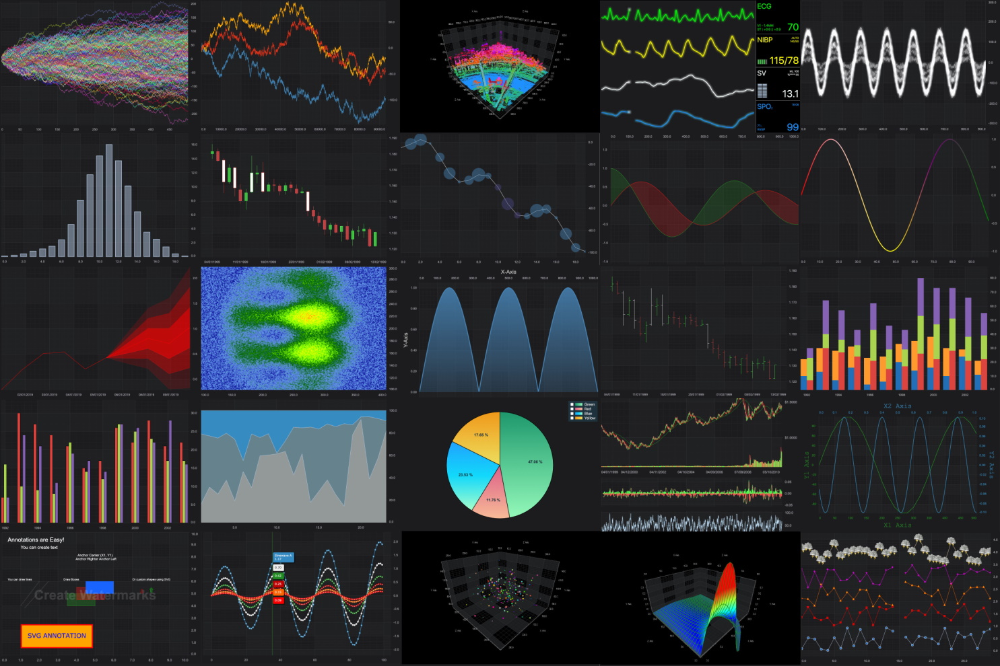
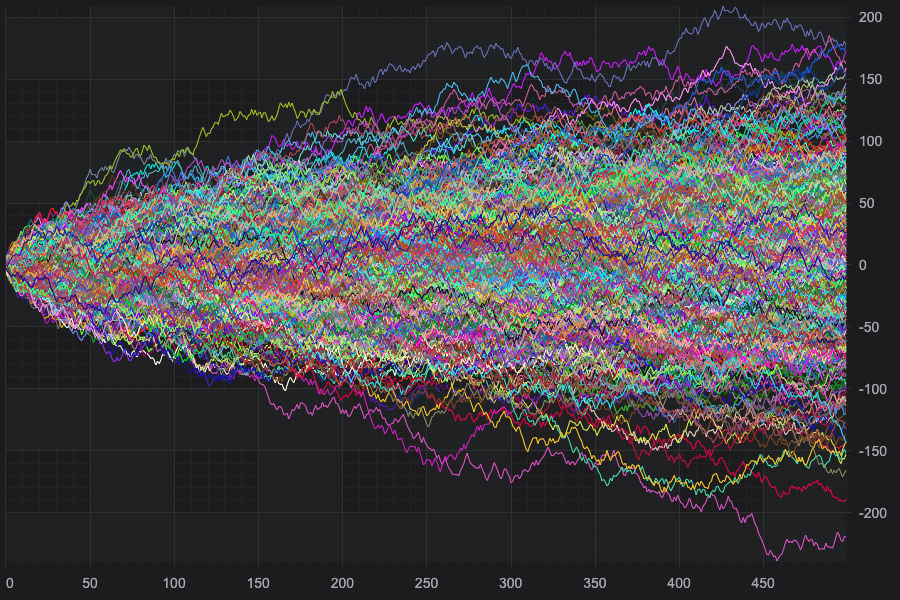
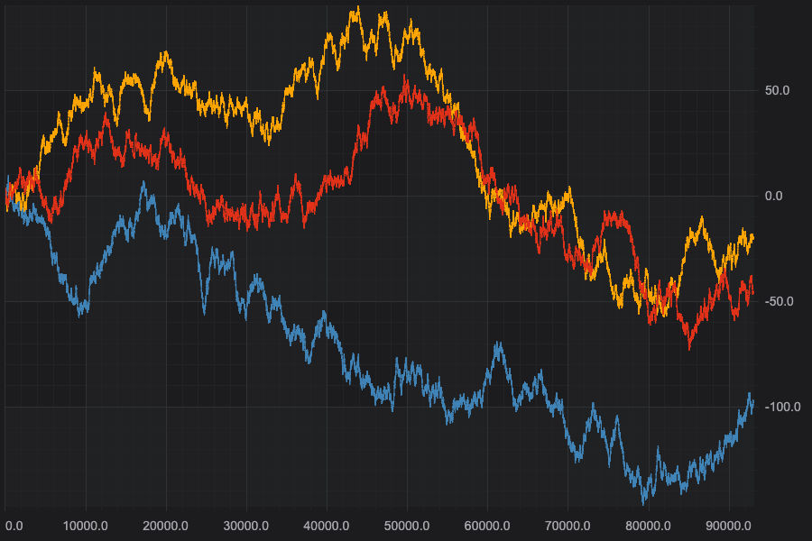
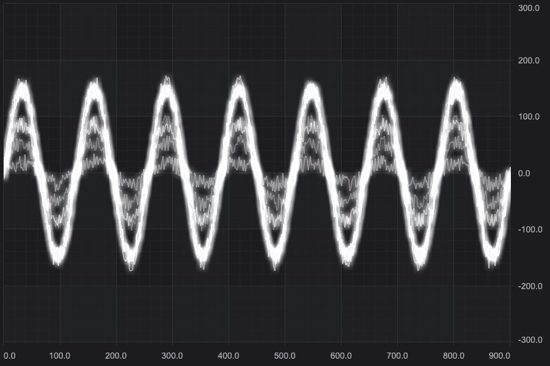
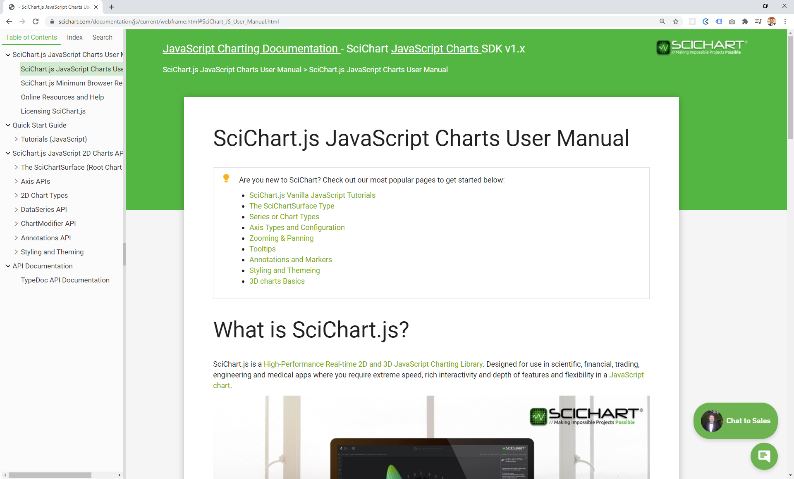

# SciChart.js JavaScript Chart Examples Suite

> **BETA TESTERS**  
> Head over to [Readme-BetaTesters.md](https://github.com/ABTSoftware/SciChart.JS.Examples/blob/master/README-BetaTesters.md) to find out how to get started in the Beta period
>
Examples, showcase applications and tutorials for **SciChart.js: Ultra High Performance Realtime [JavaScript Chart Library](https://www.scichart.com/javascript-chart-features/)**.

[](https://www.scichart.com/javascript-chart-features)

[SciChart](https://www.scichart.com) has the _**only viable solution for mission-critical charting applications**_, with our ultra-fast 2D/3D graphics technology codenamed _Visual Xccelerator&reg;_ now ported to JavaScript/TypeScript using WebGL and WebAssembly. We have cross-platform technology and provide solutions to enterprise around the world for Windows, Mobile, macOS and now JavaScript apps.


## Insane performance

[SciChart's](https://www.scichart.com) Ultra High performance [JavaScript Charts](https://www.scichart.com/javascript-chart-features/) can draw many millions of data-points, allowing you to zoom, pan, or browse big-data sets with ease. [SciChart](https://www.scichart.com) enables next-generation JavaScript &amp; TypeScript chart applications by allowing previously impossible datarates and update-rates. After all, we make 'Impossible projects possible'!

## Online Demo

An online demo version of scichart.js.examples can be seen at https://demo.scichart.com. 

**Check out the demos below:**

#### [JavaScript Chart - Load 500 Series x 500 Points Performance Demo](https://demo.scichart.com/javascript-chart-load-500-series-by-500-points)

Click **Load** in the demo to create 500 series, each with 500 points (250,000 points total) and watch the JavaScript Chart draw instantly!

[](https://demo.scichart.com/javascript-chart-load-500-series-by-500-points)

#### [Realtime JavaScript Chart Performance Demo](https://demo.scichart.com/javascript-chart-realtime-performance-demo)

Click **Start** in the demo to create three series and append 100k points per second to each, with a total point count in the millions.

[](https://demo.scichart.com/javascript-chart-realtime-performance-demo)

#### [Realtime Ghosted Traces](https://demo.scichart.com/javascript-realtime-ghosted-traces-chart)

Click **Start** to watch 10 series with thousands of points animating, while applying a glow WebGL Shader effect.

[](https://demo.scichart.com/javascript-realtime-ghosted-traces-chart)

#### [JavaScript Chart Types](https://demo.scichart.com/javascript-bubble-chart)

The demo includes many JavaScript Chart Types including [JavaScript Bubble Chart](https://demo.scichart.com/javascript-bubble-chart), a real-time [JavaScript heatmap chart](https://demo.scichart.com/javascript-heatmap-chart), a [JavaScript Candlestick Chart](https://demo.scichart.com/javascript-candlestick-chart) and many more!

SciChart.js also includes 3D Charts, and has a [JavaScript UAV LiDAR 3D Point-Cloud demo](https://demo.scichart.com/javascript-3d-lidar-visualization), a [JavaScript 3D Bubble Chart](https://demo.scichart.com/javascript-3d-bubble-chart) and a [JavaScript 3D Surface Mesh Chart](https://demo.scichart.com/javascript-3d-surface-mesh-chart).   

## Documentation

We've taken the time to create hundreds of documentation pages for our JavaScript Charts, which you can find over at https://www.scichart.com/javascript-chart-documentation. Take a look here for tutorials, getting-started guides, API Docs (TypeDoc) and more.

[](https://www.scichart.com/javascript-chart-documentation).

## Developer Quick-Start

### Licensing the application 

1. Get a trial license key from https://www.scichart.com/licensing-scichart-js/ and install **licensing wizard**.
2. Purchased license keys can be viewed at https://www.scichart.com/profile

**Licensing a domain for production**

In order to deploy an app to some domain
* Set the domain for you license on the website https://www.scichart.com/
* Copy runtime key from the **licensing wizard**
* Set the runtime key in your app before calling SciChartSurface.create. The runtime key should be set once! 
```
import {SciChartSurface} from "scichart/charting/Visuals/SciChartSurface";

SciChartSurface.setRuntimeLicenseKey("YOUR_RUNTIME_KEY");
```

### Run application in dev mode

To start the application locally you will need to `npm install` and `npm run dev` and also to have the licensing wizard running. This will run a development server locally and you should be able to view the examples in browser at http://localhost:8080

> Note: Make sure the licensing wizard is running!

> `cd Examples`   
> `npm install`   
> `npm run dev`

### Run application in production mode

To start the application in production mode, run the following scripts. Note in production mode google analytics will be enabled.

> `cd Examples`  
> `npm run build`  
> `npm start`

## Simple Code Examples

### Creating a SciChartSurface with X,Y Axis 

A SciChartSurface can be created by calling the function SciChartSurface.create(). You will need to add an X/Y axis to see the chart.

```javascript
// Create the SciChartSurface in the div 'scichart-root'
// The SciChartSurface, and webassembly context 'wasmContext' are paired. This wasmContext
// instance must be passed to other types that exist on the same surface.
const {sciChartSurface, wasmContext} = await SciChartSurface.create("scichart-root");

// Create an X,Y Axis and add to the chart
const xAxis = new NumericAxis(wasmContext);
const yAxis = new NumericAxis(wasmContext);

sciChartSurface.xAxes.add(xAxis);
sciChartSurface.yAxes.add(yAxis);
```

### Adding Series and Data

SciChart has multiple chart-types out of the box. To add a series and some data, use code like this:

```javascript
// Create the SciChartSurface in the div 'scichart-root'
// The SciChartSurface, and webassembly context 'wasmContext' are paired. This wasmContext
// instance must be passed to other types that exist on the same surface.
const {sciChartSurface, wasmContext} = await SciChartSurface.create("scichart-root");

// Create an X,Y Axis and add to the chart
const xAxis = new NumericAxis(wasmContext);
const yAxis = new NumericAxis(wasmContext);

sciChartSurface.xAxes.add(xAxis);
sciChartSurface.yAxes.add(yAxis);    

// Create 100 dataseries, each with 10k points
for (let seriesCount = 0; seriesCount < 100; seriesCount++) {        
	const xyDataSeries = new XyDataSeries(wasmContext);

	const opacity = (1 - ((seriesCount / 120))).toFixed(2);

	// Populate with some data
	for(let i = 0; i < 10000; i++) {
		xyDataSeries.append(i, Math.sin(i* 0.01) * Math.exp(i*(0.00001*(seriesCount+1))));
	}

	// Add and create a line series with this data to the chart
	// Create a line series        
	const lineSeries = new FastLineRenderableSeries(wasmContext, {
		dataSeries: xyDataSeries, 
		stroke: `rgba(176,196,222,${opacity})`,
		strokeThickness:2
	});
	sciChartSurface.renderableSeries.add(lineSeries);
}
```

### Zooming and Panning 

Zooming and Panning is really easy in SciChart.js. We have a number of ChartModifiers out of the box which will add zoom, pan behaviors and more. 

Try some code like this:

```javascript
// Add zoom, pan behaviours to the chart. Mousewheel zoom, panning and double-click to 
// zoom to fit
const mouseWheelZoomModifier = new MouseWheelZoomModifier();
const zoomPanModifier = new ZoomPanModifier();    
const rubberBandZoomModifier = new RubberBandXyZoomModifier();
const zoomExtentsModifier = new ZoomExtentsModifier();    
sciChartSurface.chartModifiers.add(zoomExtentsModifier);
sciChartSurface.chartModifiers.add(zoomPanModifier);
sciChartSurface.chartModifiers.add(rubberBandZoomModifier);
sciChartSurface.chartModifiers.add(mouseWheelZoomModifier);    
```

### Tooltips and Legends 

SciChart supports Tooltips and Legends via our ChartModifier API. [Check out documentation on our website here](https://www.scichart.com/documentation/js/current/webframe.html#RolloverModifier.html).

### Adding Annotations 

SciChart supports Annotations and Labels. [Check out documentation on our website here](https://www.scichart.com/documentation/js/current/webframe.html#The%20Annotations%20API%20Overview.html) 

### Adding Multiple Axis 

SciChart supports multiple axis, you can check out an example here: https://demo.scichart.com/javascript-chart-with-multiple-x-axis

### Linking Multiple Charts

SciChart allows linking multiple charts together to create composite applications. Check out this example: https://demo.scichart.com/javascript-multi-pane-stock-charts

## Further resources to Get Started with SciChart 

Further resources which you may find useful! 

* [The SciChart.js hand-written Documentation](https://www.scichart.com/javascript-chart-documentation)
* [The SciChart.js Video Tutorials](https://www.scichart.com/documentation/js/current/webframe.html#Tutorial%2001%20-%20Setting%20up%20a%20Project%20with%20SciChart.js.html)
* [The SciChart.js Examples Suite (online demo)](https://demo.scichart.com)
* [Features and info about SciChart.js](http://scichart.com/javascript-chart-features) 


