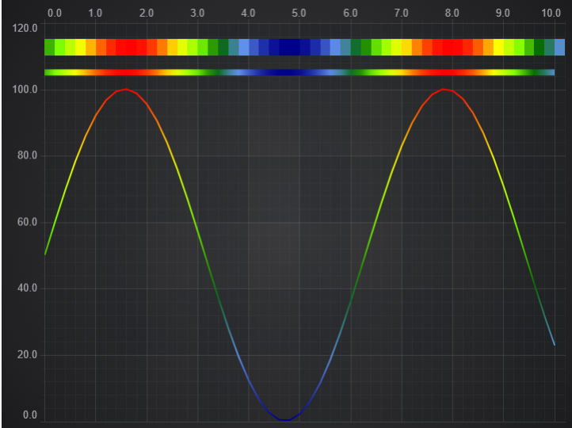

# 1D Heatmap Demo

This example showcases 2 different methods of producing a 1D heatmap.
1. Using UniformHeatmapRenderableSeries
2. Using FastLineRenderableSeries with a custom paletteProvider

## Running the Example

Open this folder in terminal and run the following commands:

* `npm install`
* `npm start`

Then visit https://localhost:8080 in your web browser!

