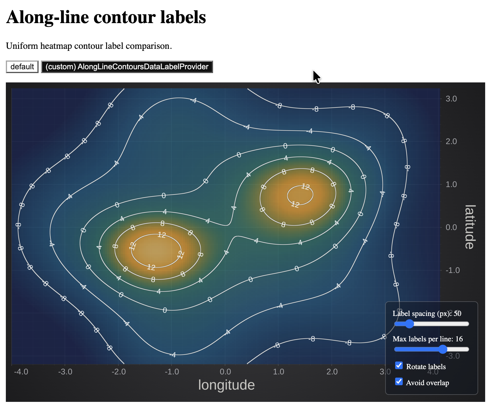

# along-line-contours

Standalone React example for the custom `AlongLineContoursDataLabelProvider` that works together with SciChart.js

```bash
npm install
npm run dev
```

The custom mode controls sit over the chart. The label algorithm splits every gap in half at each subdivision level, so existing labels stay put while zooming adds more. Closed loops label all `2^n` parts; open lines leave the two endpoints clear and use `2^n - 1` labels. The max-labels slider therefore steps through `1, 2, 4, 8, 16, 32, 64`.


## Screenshot: 
