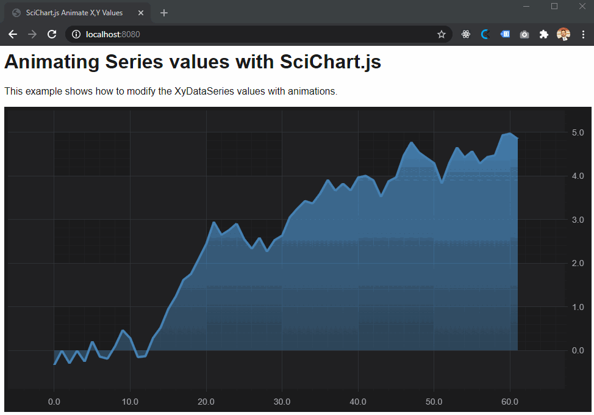

# SciChart.js Example - Animate Xy Values of a Series

This example showcases how to set SciChart.js to animate new values appended to a series 

This is done with the use of the DoubleAnimator helper function inside SciChart.js core 

## Running the Example

To run the tutorial, open this folder in VSCode, and run the following commands:

> npm install
> npm start 

Then visit https://localhost:8080 in your web browser! 

## What it does

This example creates a JavaScript Mountain Chart then animates its X,Y value using a helper function. 
 


## How it works

We can access the XyDataSeries values directly via the getNativeXValues() and getNativeYValues() getter functions. From there we can update the values. 

We can also use the DoubleAnimator type to do an animation from 0..1 and calculate our animated values.
 
```typescript
// This function performs animation on any XyDataSeries, animating the latest point only
// Be careful of reentrancy, e.g. calling animateXy more than once before previous animation has finished
// might require special handling
const animateXy = (xyDataSeries, endX, endY, duration, easing) => {
    const count = xyDataSeries.count();
    const startX = xyDataSeries.getNativeXValues().get(count - 1);
    const startY = xyDataSeries.getNativeYValues().get(count - 1);

    // Consider removing console.log for prod
    console.log(`Animate point ${count-1} X from ${startX} to ${endX}`);
    console.log(`Animate point ${count-1} Y from ${startY} to ${endY}`);
    //

    // use the DoubleAnimator class in scichart/Core/Animations/ to setup an animation from 0...1
    DoubleAnimator.animate(0, 1, duration, (interpolationFactor) => {
            // Using the interpolation factor (ranges from 0..1) compute the X,Y value now
            const currentX = (endX - startX) * interpolationFactor + startX;
            const currentY  = (endY - startY) * interpolationFactor + startY;

            // Update X,Y value by direct access to the inner webassembly arrays
            xyDataSeries.getNativeXValues().set(count - 1, currentX);
            xyDataSeries.getNativeYValues().set(count - 1, currentY);

            // Force redraw
            // can use xyDataSeries.notifyDataChanged(); to just update, but if we want to zoom to fit, we must use zoomExtents
            sciChartSurface.zoomExtents();
        },
        () => {
            // Animation complete, append the point
            xyDataSeries.append(endX, endY);
        }, easing);
};

// Usage
const xyDataSeries = new XyDataSeries(wasmContext);
 ... 

animateXy(xyDataSeries, 10, 20, duration, easing.inOutExpo);
animateXy(xyDataSeries, 20, 30, duration, easing.inOutExpo);
```

Give us your feedback if you notice any issues or want further assistance!

