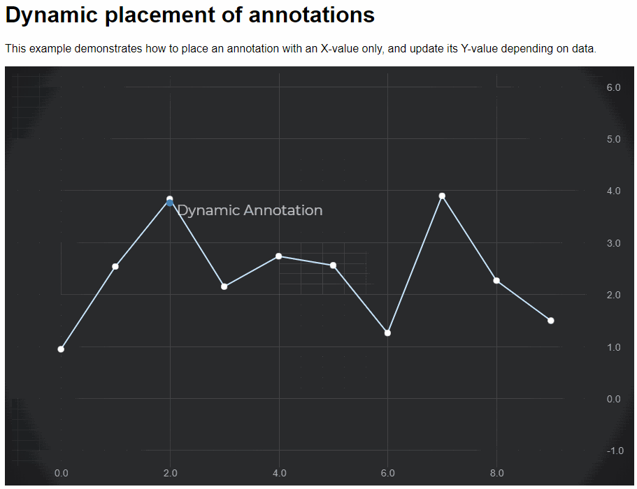

# SciChart.js Example - Dynamic Annotations as Data changes

This example showcases how to position an annotation in SciChart.js dynamically as data changes. 



A ```CustomAnnotation``` is created with SVG showing a pulsing dot. This is added to the chart.

We subscribe to ```sciChartSurface.rendered``` to get a callback when the chart updates. 

In this callback, using ```FindIndex``` on the ```xyDataSeries.getNativeXValues()``` we can get the index to the data for a specific X-Value. Next, we can get the Y-value via ```xyDataSeries.getNativeYValues().get(index)```

The annotation is postioned using this yValue. 

Lastly, we use SciChart.js Data Animations feature to update some data, so you can see the ```CustomAnnotation``` moving as data updates.

## Running the Example

To run the tutorial, open this folder in VSCode, and run the following commands:

> npm install
> npm start 

Then visit https://localhost:8080 in your web browser! 


Give us your feedback if you notice any issues or want further assistance!

