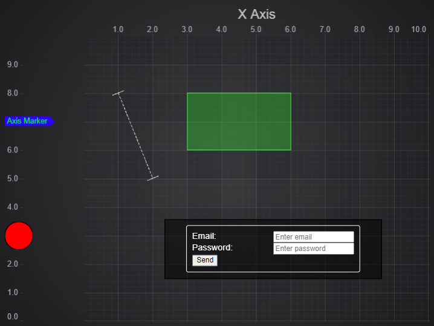

# Annotations Demo

This example showcases:

* How to add extra space for AxisMarkerAnnotation
* How to load an image asynchronously
* How to listen to on hover event and change the cursor (uses `MouseOverAnnotationModifier`)
* How to listen to isSelected event (uses `CustomBoxAnnotation`)

## Running the Example

Open this folder in terminal and run the following commands:

* `npm install`
* `npm start`

Then visit https://localhost:8080 in your web browser!

