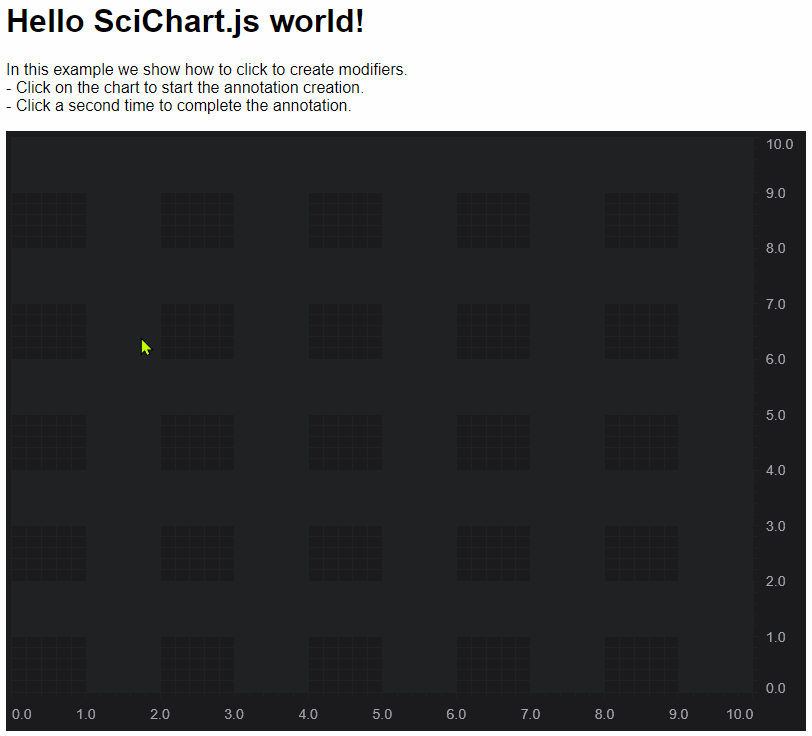

# SciChart.js Example - Create Annotations on mouse-down

This example showcases how to use the ChartModifierBase API in SciChart.js to listen to mouse events. 

## Running the Example

To run the tutorial, open this folder in VSCode, and run the following commands:

> npm install
> npm start 

Then visit https://localhost:8080 in your web browser! 

## What it does

This example adds simple annotation-creation behaviour to the chart, by creating a custom ChartModifier



## How it works

The ChartModifier requires that we use TypeScript (JavaScript ES6 may also work) as we need to extend a class: ChartModifierBase2D. 

We extend the class like this:

```typescript
export class CreateAnnotationModifier extends ChartModifierBase2D {
    private editingAnnotation: IAnnotation;

    constructor() {
        super();
    }

    // Called when mouse-down on the chart
    public modifierMouseDown(args: ModifierMouseArgs): void{
        super.modifierMouseDown(args);

        if (!this.editingAnnotation) {
            // If no editingAnnotation, then begin create one
            this.beginCreateAnnotation(args.mousePoint);
        } else {
            // If already editingAnnotation, then end the creation and reset flags
            this.updateAnnotation(args.mousePoint);
            this.editingAnnotation = undefined;
        }
    }

    // Called when mouse-move on the chart
    public modifierMouseMove(args: ModifierMouseArgs): void {
        super.modifierMouseMove(args);

        // Update the annotation
        if (this.editingAnnotation) {
            this.updateAnnotation(args.mousePoint);
        }
    }

    // Called when mouse-up on the chart
    public modifierMouseUp(args: ModifierMouseArgs) {
        super.modifierMouseUp(args);
    }

    private beginCreateAnnotation(mousePoint: Point) {

        // Assumes that the parent chart has a single x & y axis.
        // You will need to include more logic here for multi axis surfaces
        const xAxis = this.parentSurface.xAxes.get(0);
        const yAxis = this.parentSurface.yAxes.get(0);

        // Create an annotation and assign X,Y axis id
        // If you want to dynamically select which type of annotation to create, consider
        // adding a property to CreateAnnotationModifier to allow you to select type, and a switch statement here.
        this.editingAnnotation = new LineAnnotation();
        this.editingAnnotation.xAxisId = xAxis.id;
        this.editingAnnotation.yAxisId = yAxis.id;

        // Set the X,Y coords of the annotation. Note that the pixel coordinates of the mouse-down
        // event must be translated to data-coordinates so that the annotation is placed on the chart
        this.editingAnnotation.x1 = xAxis.getCurrentCoordinateCalculator().getDataValue(mousePoint.x);
        this.editingAnnotation.x2 = xAxis.getCurrentCoordinateCalculator().getDataValue(mousePoint.x);
        this.editingAnnotation.y1 = yAxis.getCurrentCoordinateCalculator().getDataValue(mousePoint.y);
        this.editingAnnotation.y2 = yAxis.getCurrentCoordinateCalculator().getDataValue(mousePoint.y);

        // Add the annotation to the surface
        this.parentSurface.annotations.add(this.editingAnnotation);
    }

    private updateAnnotation(mousePoint: Point) {
        // Update the position of an annotation using its X,Y Axis and the
        // coordinate calculator to transform to coordinate
        const xAxis = this.parentSurface.getXAxisById(this.editingAnnotation.xAxisId);
        const yAxis = this.parentSurface.getYAxisById(this.editingAnnotation.yAxisId);

        this.editingAnnotation.x2 = xAxis.getCurrentCoordinateCalculator().getDataValue(mousePoint.x);
        this.editingAnnotation.y2 = yAxis.getCurrentCoordinateCalculator().getDataValue(mousePoint.y);
    }
}
```

This ChartModifierBase2D derived class has functions modifierMouseDown, modifierMouseMove, modifierMouseUp, which are called when the user mouse down/move/up on the chart. 

We add an Annotation onto the parent SciChartSurface on mousedown, and update its position as the user moves the mouse

A second click completes the annotation.

TODO: 

 - You can modify this sample to perform some annotation or drawing action on mouse-down
 - Perhaps you want to change the type of annotation you can add? In this case pass a string AnnotationType to the modifier and use a Switch statement when creating the annotation 

 
Give us your feedback about what else you want to do with the annotation-creation example.

