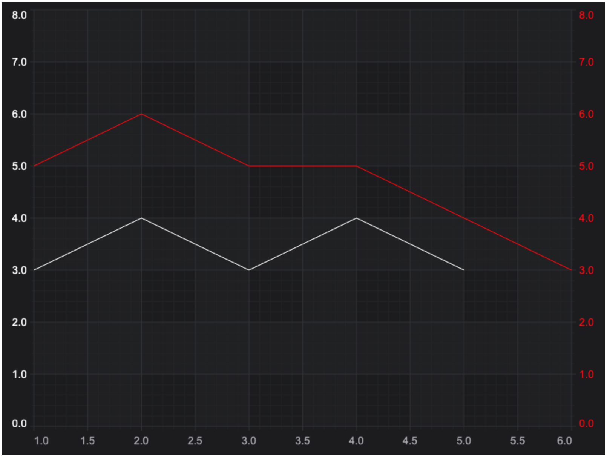

# Dragging Series Demo

This example showcases how to create a custom chart modifier to perform series dragging. The example uses custom chart modifier and HitTestAPI.

## Running the Example

To run the tutorial, open this folder in VSCode, and run the following commands:

* `npm install`
* `npm start`

Then visit https://localhost:8080 in your web browser!

## What it does

This example adds custom DragSeriesModifier to the chart.



## How it works

The DragSeriesModifier requires that we use TypeScript (JavaScript ES6 may also work) as we need to extend a class: ChartModifierBase2D.

We extend the class like this:

```typescript
export class DragSeriesModifier extends ChartModifierBase2D {
    ...

    constructor(options?: IChartModifierBaseOptions) {
        super(options);
    }
    ...
}
```
