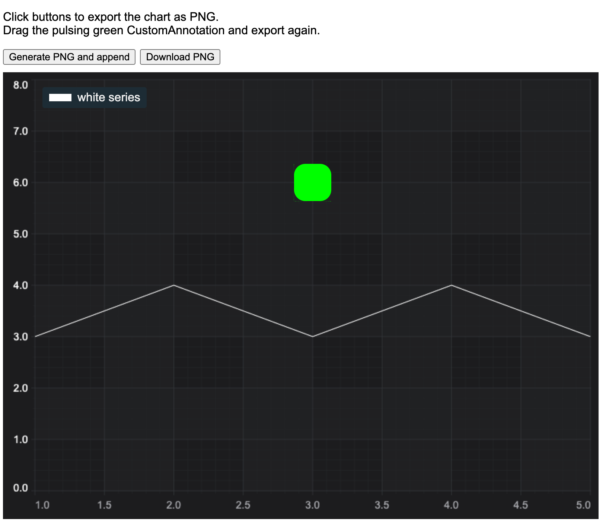

# Export Chart to Image Demo

This example showcases how to export SciChart.js chart to PNG image.

## Running the Example

To run the tutorial, open this folder in VSCode, and run the following commands:

* `npm install`
* `npm start`
* visit https://localhost:8080 in your web browser!



## How it works

The example uses `dom-to-image` npm module to export the chart to PNG image. This package exports html (used for legends), svg (used for annotations) and canvas (used everything else) elements.

To download the image we use the `file-saver` module.

For the export to work correctly `position: relative` should be set on the chart root element.

```html
<div id="scichart-root" style="position: relative"></div>
```
