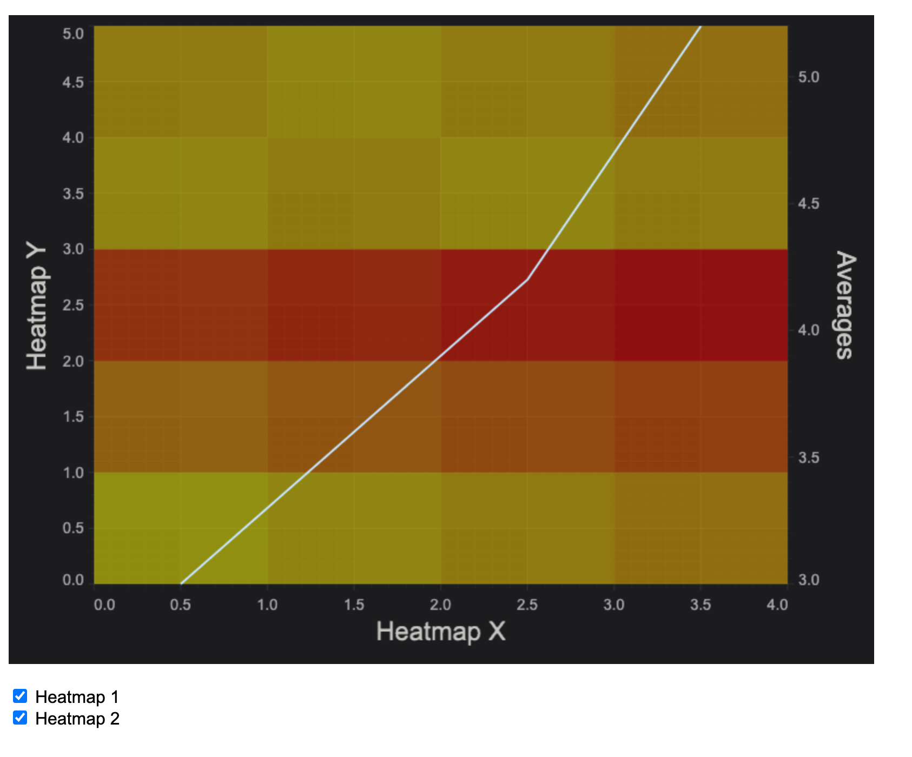

# SciChart.js Example - Uniform Heatmap Chart with Averages

This example showcases how to create Heatmap Chart and Line Chart with average values for each column.

## Running the Example

To run the example, open this folder in VSCode, and run the following commands:

> npm install
> npm start

Then visit https://localhost:8080 in your web browser! 

## What it does

This example has two UniformHeatmapRenderableSeries and one FastLineRenderableSeries that has calculated average zValues for each column.

## How it works

Each time when the user checks/unchecks visibility of a Heatmap, `updateLineChart()` function runs and XyDataSeries is recreated with the new yValues. This new data series is being assigned for the Line Chart with averages. 

