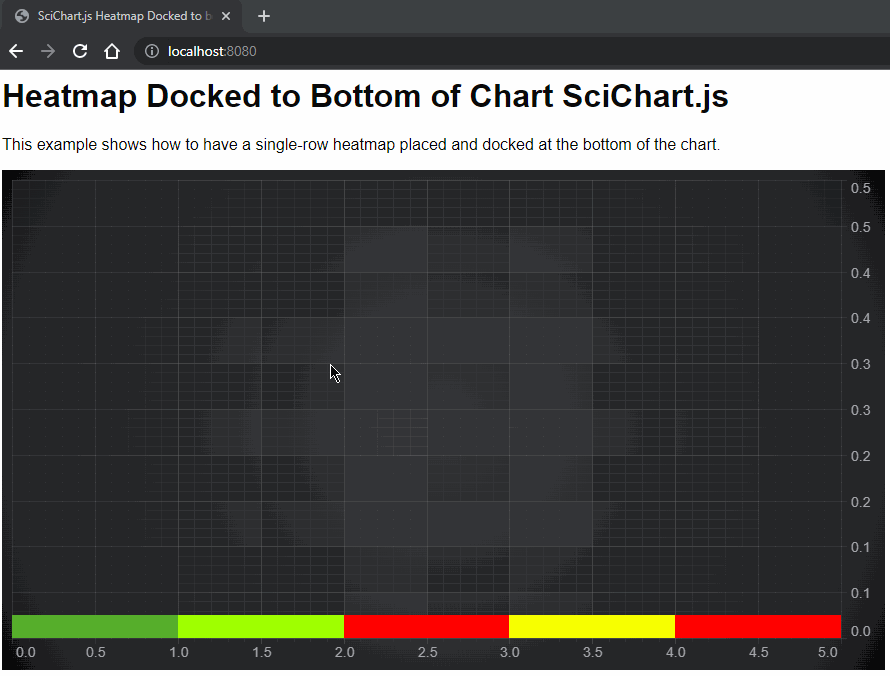

# SciChart.js Example - Heatmap Docked to Bottom of Chart

Demonstrates how to create a single-row height Heatmap and add to a SciChart.js chart docked to the bottom.

The requirement is to always have the heatmap at the bottom of the chart (regardless of zoom level). It must be a specific height. 

The heatmap is 1-row high and if you scroll left/right should scroll with the chart. 

## Running the sample

```
npm install
npm dev
```

Then visit https://localhost:8080 in your web browser!

Give us your feedback if you notice any issues or want further assistance!

## How the sample works

The example creates a HeatmapDataSeries and UniformHeatmapRenderableSeries and adds it to a SciChartSurface with X and Y Axis

```javascript 
    const { sciChartSurface, wasmContext } = await SciChartSurface.create("scichart-root");

    sciChartSurface.xAxes.add(new NumericAxis(wasmContext));
    const yAxis = new NumericAxis(wasmContext, {
        visibleRange: new NumberRange(0, 10)
    });
    sciChartSurface.yAxes.add(yAxis);

    const heatMapData = zeroArray2D([1, 5]);
    heatMapData[0][0] = 22.05; //should appear as color1 in heatmap
    heatMapData[0][1] = 24.00; //...
    heatMapData[0][2] = 30.00; //should appear as color2 in heatmap
    heatMapData[0][3] = 26.75;
    heatMapData[0][4] = 30.00; //should appear as color3 in heatmap

    const heatmapDataSeries = new UniformHeatmapDataSeries(wasmContext, {
        xStart: 0,
        xStep: 1,
        yStart: 0,
        yStep: 1,
        zValues: heatMapData
    });

    const heatmapSeries = new UniformHeatmapRenderableSeries(wasmContext, {
        dataSeries: heatmapDataSeries,
        colorMap: new HeatmapColorMap({
            minimum: 20, // min value in the zValues (data) to map to offset 0 in the colormap
            maximum: 30, // max value in the zValues (data) to map to offset 1 in the colormap
            gradientStops: [
                { offset: 0, color: "#00008B" },
                { offset: 0.3, color: "#7FFF00" },
                { offset: 0.7, color: "#FFFF00" },
                { offset: 1.0, color: "#FF0000" },
            ],
        }),
    });

    sciChartSurface.renderableSeries.add(heatmapSeries);
```

Next some zooming and panning modifiers are added

```javascript 
    sciChartSurface.chartModifiers.add(
        new ZoomPanModifier(),
        new MouseWheelZoomModifier()
    )
```

Finally, we ~~hack~~ override HeatmapDataSeries.getYRange() to force positioning on a part of the chart. 

```javascript 
    // OPTIONAL:
    // Override HeatmapDataSeries.getYRange() to always return the bottom 5% of the chart
    // NOTE: Use this with caution as DataSeries.getYRange() is also used in the yAxis autorange algorothm
    // so you will need to specify a visiblerange on the yaxis or have other series as well.
    heatmapDataSeries.getYRange = () => {
        return new NumberRange(yAxis.visibleRange.min, yAxis.visibleRange.diff * 0.05 + yAxis.visibleRange.min);
    };
```

The result is this! 


