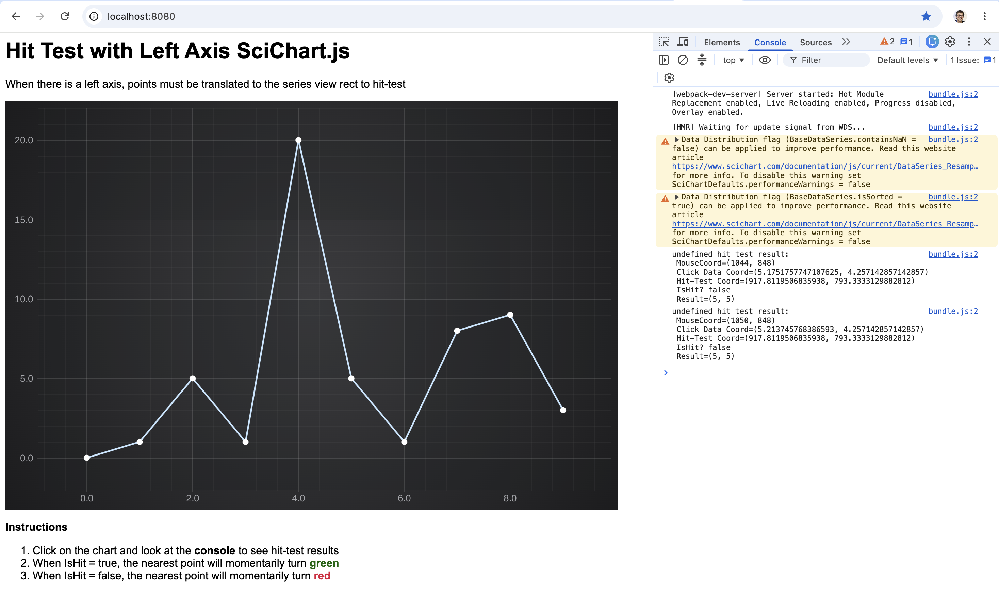

# SciChart.js Example - Hit-Testing Points Demo

This example showcases how to use the Hit-Test API in SciChart.js.



On click ```lineSeries.hitTestProvider.hitTest``` is called and this returns a ```HitTestInfo``` object. 

Querying the properties lets you determine if the user clicked over a point or not. 

The nearest point is plotted and is coloured red or green depending on hit or miss.

The clicked location in X/Y data coordinates is also logged to the console via ```hitTestInfo.hitTestPointValues```.

## Running the Example

To run the tutorial, open this folder in VSCode, and run the following commands:

> npm install
> npm start 

Then visit https://localhost:8080 in your web browser! 


Give us your feedback if you notice any issues or want further assistance!

