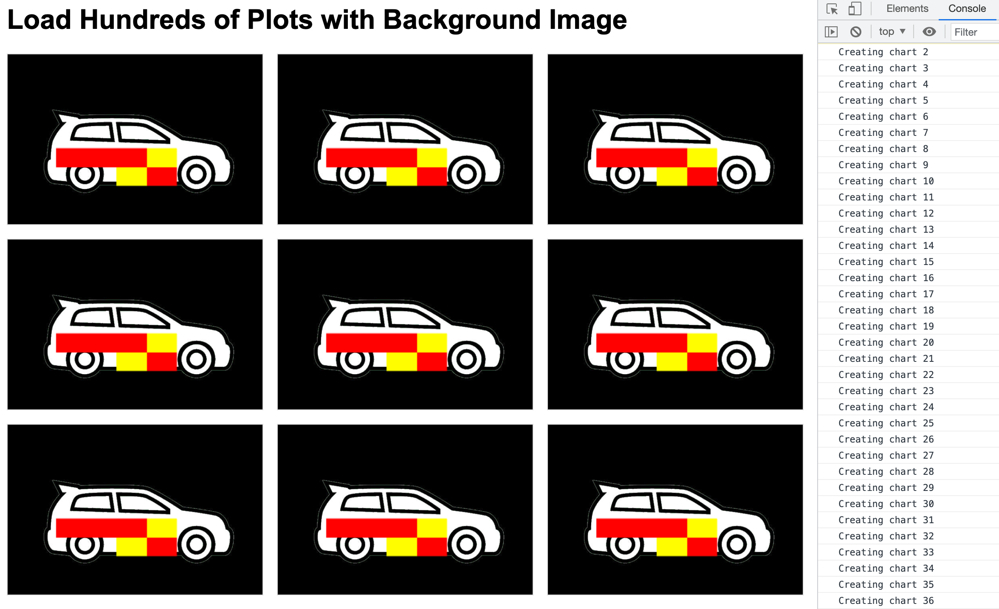

# SciChart.js Example - Load Hundreds of Plots with Background Image

This example showcases:
* the performance for creating 300 charts
* how to set an image on the background of SciChartSurface
* how to use NaN values in the UniformHeatmapRenderableSeries

## Running the Example

To run the example, open this folder in the terminal, and run the following commands:

* `npm install`
* `npm start`

Then visit https://localhost:8080 in your web browser! 

## What it does

The example creates 300 charts with the hatchback image on the background and the UniformHeatmapRenderableSeries with NaN values.

