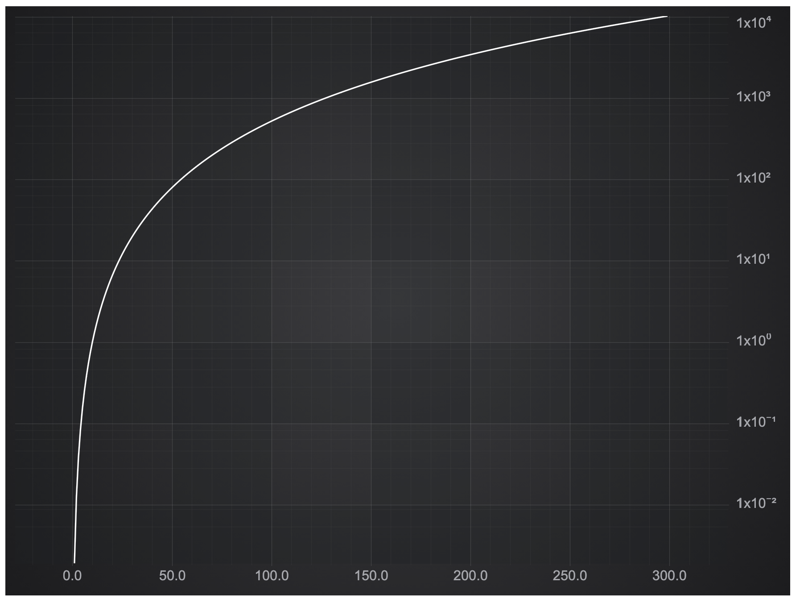

# Logarithmic Axis

This example showcases the LogarithmicAxis.

## Running the Example

To run the tutorial, open this folder in VSCode, and run the following commands:

* `npm install`
* `npm start`

Then visit https://localhost:8080 in your web browser!

## What it does

This example has a simple chart with the logarithmic axis.



## How it works

```typescript
const { sciChartSurface, wasmContext } = await SciChartSurface.create('scichart-root');
const xAxis = new NumericAxis(wasmContext, { growBy: new NumberRange(0.1, 0.1) });
const yAxis = new LogarithmicAxis(wasmContext);
sciChartSurface.xAxes.add(xAxis);
sciChartSurface.yAxes.add(yAxis);
```
