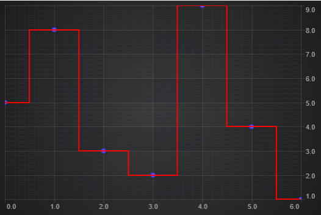

# Nearest Neighbour Interpolation

This example shows how to implement Nearest Neighbour Interpolation using a custom filter.

Run this example online using [CodeSandbox](https://codesandbox.io/s/scichart-nearest-neighbor-interpolation-shpfzh)

## Running the Example

To run the tutorial, open this folder in VSCode, and run the following commands:

* `npm install`
* `npm start`

Then visit https://localhost:1234 in your web browser!

## What it does

Nearest Neighbour Interpolation means for each x coordinate, taking the y value from the closest x data value.  This results in a digital line where the original data points are at the midpoint of the horizontal sections.  You can achieve this in scichart with a fairly simple custom filter that calculates the x positions where the value changes (mid way between the x values).

If you were using this with data that you wanted to append to dynamically, the you would also override filterOnAppend so that you do not need to recalculate the entire series for each append.

