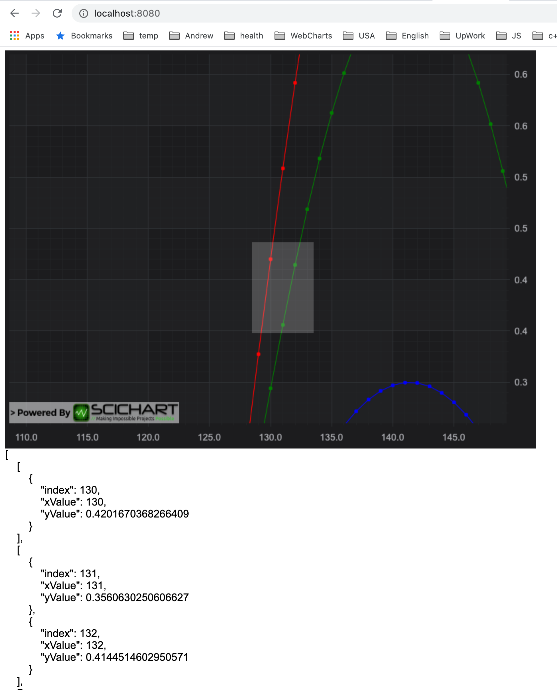

# SciChart.js Example - Simple Data Point Selection

This example showcases how to use the ChartModifierBase API in SciChart.js to select point on the chart.

## Running the Example

To run the tutorial, open this folder in VSCode, and run the following commands:

* `npm install`
* `npm start` 

Then visit https://localhost:8080 in your web browser! 

## What it does

This example adds area-selection behaviour to the chart, by creating a custom ChartModifier



## How it works

The ChartModifier requires that we use TypeScript (JavaScript ES6 may also work) as we need to extend a class: ChartModifierBase2D. 

We extend the class like this:

```typescript
export class SimpleDataPointSelectionModifier extends ChartModifierBase2D {
    private startPoint: Point;
    private endPoint: Point;
    private readonly selectionAnnotation: BoxAnnotation;
    private isSelecting: boolean;
    private selectedPoints: TDataPoint[][] = [];

    constructor() {
        super();

        // Create an annotation with YCoordinateMode Relative, and Y1, Y2 = 0,1
        // This stretches the annotation to fit the viewport in the Y-direction
        // Below in modifierMouseMove we will be updating the annotation X-values as the mouse is moved.
        this.selectionAnnotation = new BoxAnnotation({
            yCoordinateMode: ECoordinateMode.Pixel,
            xCoordinateMode: ECoordinateMode.Pixel,
            fill: "#ffffff33",
            strokeThickness: 0
        });
    }

    // Called when mouse-down on the chart
    public modifierMouseDown(args: ModifierMouseArgs): void {
        super.modifierMouseDown(args);
        // Point coordinates relative to series view rectangle.
        const translatedPoint = translateFromCanvasToSeriesViewRect(
            args.mousePoint,
            this.parentSurface.seriesViewRect
        );
        if (translatedPoint) {
            this.startPoint = translatedPoint;
            this.endPoint = translatedPoint;

            this.selectionAnnotation.x1 = translatedPoint.x;
            this.selectionAnnotation.x2 = translatedPoint.x;
            this.selectionAnnotation.y1 = translatedPoint.y;
            this.selectionAnnotation.y2 = translatedPoint.y;
            this.isSelecting = true;

            this.parentSurface.annotations.remove(this.selectionAnnotation);
            this.parentSurface.annotations.add(this.selectionAnnotation);
        }
    }

    // Called when mouse-move on the chart
    public modifierMouseMove(args: ModifierMouseArgs): void {
        super.modifierMouseMove(args);
        const translatedPoint = translateFromCanvasToSeriesViewRect(
            args.mousePoint,
            this.parentSurface.seriesViewRect
        );

        if (translatedPoint && this.isSelecting) {
            this.endPoint = args.mousePoint;
            this.selectionAnnotation.x2 = translatedPoint.x;
            this.selectionAnnotation.y2 = translatedPoint.y;
        }
    }

    // Called when mouse-up on the chart
    public modifierMouseUp(args: ModifierMouseArgs) {
        super.modifierMouseUp(args);
        this.isSelecting = false;
        this.performSelection();
        console.log("selectedPoints", this.selectedPoints);
        document.getElementById("result").innerText = JSON.stringify(
            this.selectedPoints,
            null,
            4
        );
        this.startPoint = undefined;
        this.endPoint = undefined;
    }

    private performSelection() {
        ...
    }
}
```

This ChartModifierBase2D derived class has functions modifierMouseDown, modifierMouseMove, modifierMouseUp, which are called when the user mouse down/move/up on the chart. 

We add an Annotation (a BoxAnnotation) onto the parent SciChartSurface on mousedown, and position it as the user moves the mouse

This lets us display a selection rectangle on the chart with mouse move. 

On mouse up we perform data points selection iterating over all RenderableSeries of the SciChartSurface.
