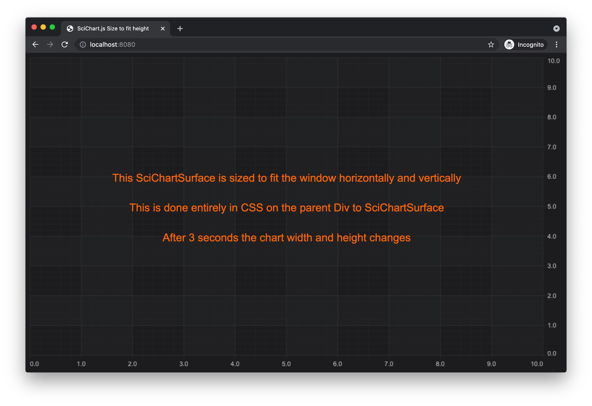

# SciChart.js Example - Size SciChartSurface to fit Height

This example showcases **how to set SciChart.js to size to fit the window vertically**. 

Also it shows **how to change the chart size dynamically** by changing width and hight after 3 seconds. 

SciChart.js is hosted inside a `<div>` so all you need to do is place the `<div>` using CSS or JavaScript and the chart will automatically fit the available space 

## Running the Example

To run the tutorial, open this folder in a terminal, and run the following commands:

* npm install
* npm start 

Then visit https://localhost:8080 in your web browser! 

## What it does

This example creates a Div to fill the parent area and puts a SciChartSurface in it. After 3 seconds charts size changes to fixed width and height 900px*600px
 


## How it works

This example requires simple CSS to change the size of the parent div. SciChart sizes to fit the parent div.  

```html
<div id="scichart-container" style="height: 100vh;">
    <!-- the Div where the SciChartSurface will reside -->
    <div id="scichart-root" style="width: 100%; height:100%;"></div>
</div>
```

Give us your feedback if you notice any issues or want further assistance!

