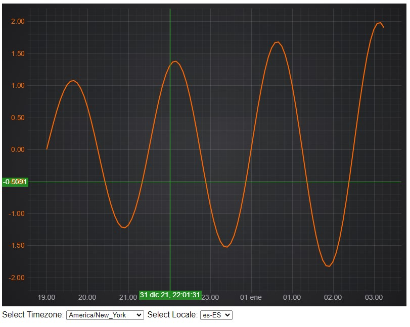

# Smart Axis Labels with Timezone Support

This example showcases:

* How to add Time Zones support
* How to place axis labels nicely for the Date axis
* How to customize labels format according to the Locale
* How to customize labels for Cursor and Rollover chart modifiers

## Running the Example

Open this folder in terminal and run the following commands:

* `npm install`
* `npm start`

Then visit https://localhost:8080 in your web browser!

