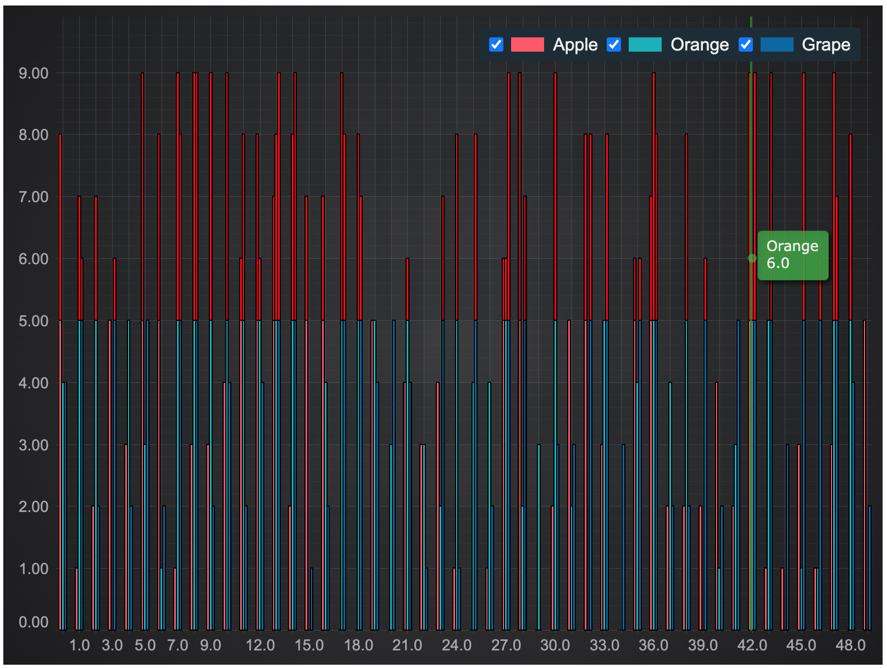

# Stacked Column Chart with Threshold Demo

This example showcases how to create a stacked column chart with threshold

## Running the Example

Open this folder in terminal and run the following commands:

* `npm install`
* `npm start`

Then visit https://localhost:8080 in your web browser!

