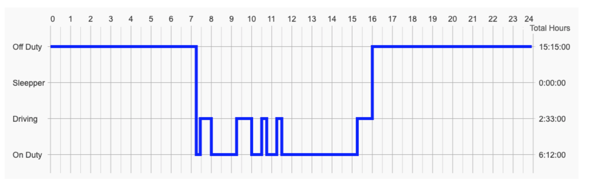

# Step Line Hours of Service Chart

This example showcases how to create a Step Line Hours of Service Chart.

## Running the Example

To run the tutorial, open this folder in VSCode, and run the following commands:

* `npm install`
* `npm start`

Then visit https://localhost:8080 in your web browser!
