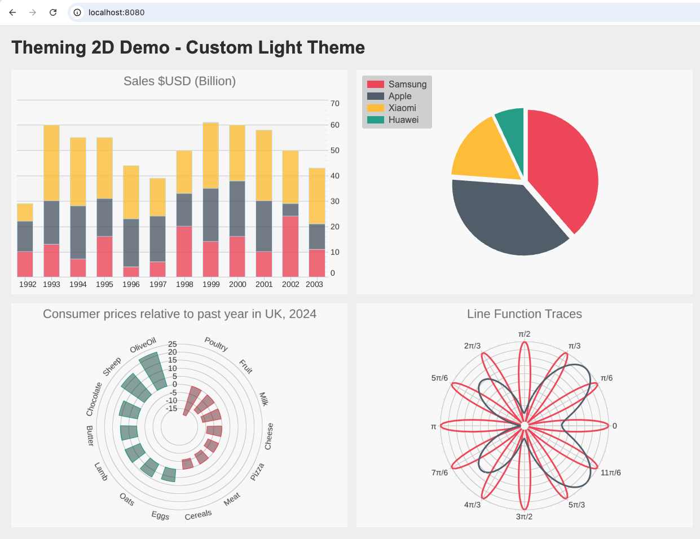

# Custom Theming 2D

A SciChart.JS demo showcasing a custom light theme applied across four chart types: Stacked Column, Pie, Polar Column, and Polar Line.



## Getting Started

```bash
npm install
npm start
```

Then open [http://localhost:8080](http://localhost:8080) in your browser.

## Customization

- **Colors** — edit `src/colorPalette.ts` to change the four palette colors used across all charts.
- **Theme** — edit `src/CustomLightTheme.ts` to change background, grid lines, axis labels, and all other chart styling properties.
