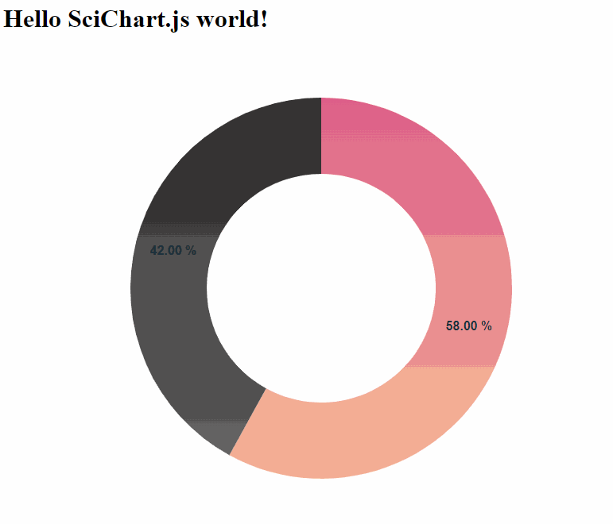

# Simple Chart with Webpack and NPM

Demonstrates how to update a donut chart dynamically using SciChart.js
## Trial licensing

Ensure you have followed steps from our [getting-started](https://www.scichart.com/getting-started-scichart-js) guide to get a trial!

## How to run the project

* `npm install`
* `npm start`



## Description

### webpack.config.js

Use CopyPlugin to copy wasm and data files and serve them by webpack-dev-server. SciChart.js uses WebAssembly and those files **scichart2d.data**, **scichart2d.wasm** must be loaded.

```javascript
const path = require('path');
const CopyPlugin = require("copy-webpack-plugin");

module.exports = {
  mode: 'development',
  entry: "./src/index.js",
  performance: {
    hints: false
  },
  output: {
    path: path.resolve(__dirname, 'build'),
    filename: 'bundle.js',
  },
  plugins: [
    new CopyPlugin({
      patterns: [
        { from: "src/index.html", to: "" },
        { from: "node_modules/scichart/_wasm/scichart2d.data", to: "" },
        { from: "node_modules/scichart/_wasm/scichart2d.wasm", to: "" }
      ]
    })
  ]
};
```
Alternative methods such as SciChartSurface.useWasmFromCDN(); can automatically load our wasm/data files from CDN and save the above deployment.

### Chart div element

If you call `SciChartPieSurface.create("scichart-root")` an element with Id "scichart-root" must be present.

```html
<html lang="en-us">
    <head>
        <meta charset="utf-8" />
        <meta content="text/html; charset=utf-8" http-equiv="Content-Type" />
        <title>SciChart.js Tutorial 1</title>
        <script async type="text/javascript" src="bundle.js"></script>
    </head>
    <body>
        <!-- the Div where the SciChartSurface will reside -->
        <div id="scichart-root" style="width: 800px; height: 600px;"></div>
    </body>
</html>
```

# SciChart.js Tutorials and Getting Started

We have a wealth of information on our site showing how to get started with SciChart.js!

Take a look at:

* [Getting-Started with SciChart.js](https://www.scichart.com/getting-started-scichart-js): includes trial licensing, first steps and more
* [Javascript / npm tutorials](https://www.scichart.com/documentation/js/current/Tutorial%2002%20-%20Adding%20Series%20and%20Data.html): using npm, webpack, and scichart.js, create static and dynamic charts with zooming, panning tooltips and more
* [Vanilla Javascript tutorials](https://www.scichart.com/documentation/js/current/Tutorial%2001%20-%20Including%20SciChart.js%20in%20an%20HTML%20Page.html): using only vanilla javascript and HTML,
* [Official scichart.js demos](https://demo.scichart.com): view our demos online! Full github source code also available at [github.com/abtsoftware/scichart.js.examples](https://github.com/abtsoftware/scichart.js.examples)

