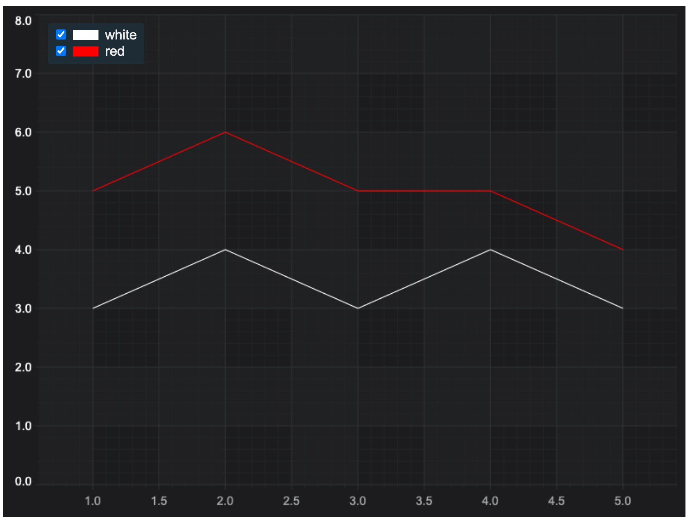
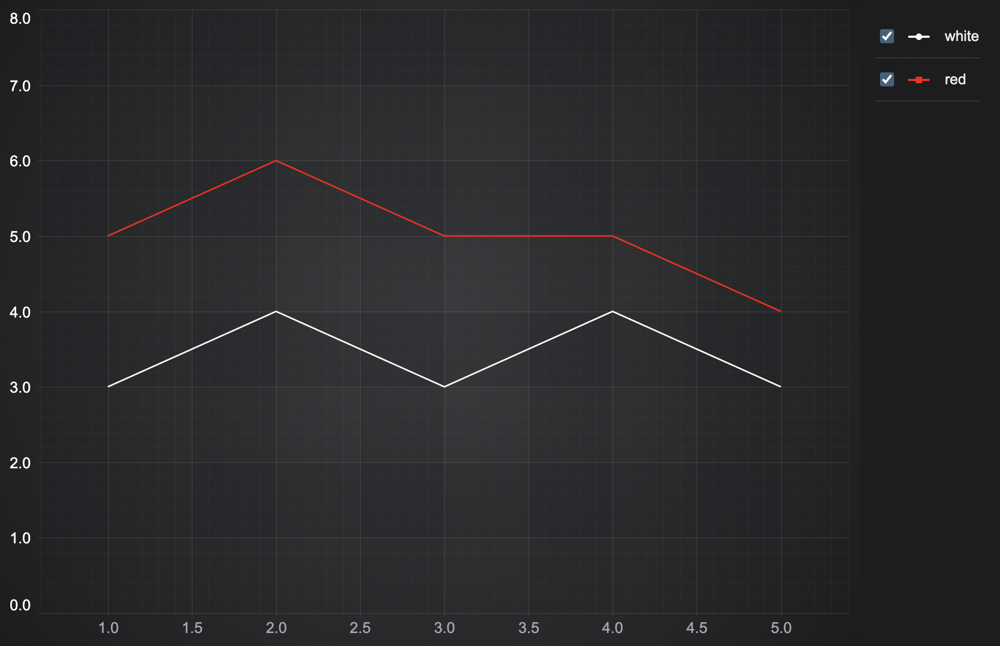
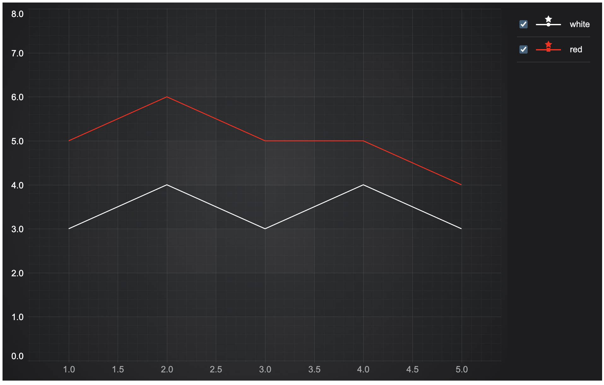

# Updating the Legend

This example showcases how to update LegendModifier checkboxes programmatically.

## Running the Example

To run the tutorial, open this folder in VSCode, and run the following commands:

* `npm install`
* `npm start`

Then visit https://localhost:8080 in your web browser!

## What it does

This example has two FastLineRenderable series and checkboxes which are updated asynchronously using setTimeout function.



## How it works

The white legend checkbox is clicked programmatically after 2 seconds and the white series is hidden.

After 2 seconds it is clicked again. There are console log messages for each event

We extend the class like this:

```typescript
    ...
    const lineSeries1 = new FastLineRenderableSeries(wasmContext, {
        stroke: 'white',
        dataSeries: new XyDataSeries(wasmContext, {
            xValues: [1, 2, 3, 4, 5],
            yValues: [3, 4, 3, 4, 3],
            dataSeriesName: 'white'
        })
    });
    ...
    sciChartSurface.chartModifiers.add(new LegendModifier({ showCheckboxes: true }));
    setTimeout(() => {
    console.log('hide the white series');
    const checkbox1 = document.getElementById(lineSeries1.id) as HTMLInputElement;
    checkbox1.click();
    setTimeout(() => {
        console.log('show the white series back');
        checkbox1.click();
    }, 2000);
}, 2000);
```
## Legend Customization

With placementDivId legend can be attached into a specific element in the DOM and then customizable unically by id with CSS.



Example of rewriting (getLegendItemHTML):

