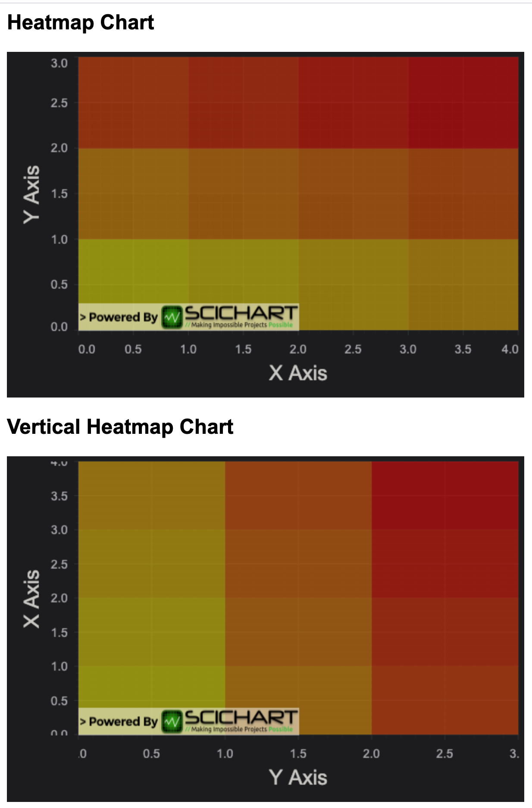

# SciChart.js Example - Vertical Heatmap Chart

This example showcases how to create the Vertical Heatmap Chart.

## Running the Example

To run the tutorial, open this folder in VSCode, and run the following commands:

* `npm install`
* `npm start` 

Then visit https://localhost:8080 in your web browser! 

## What it does

This example shows how create Vertical Heatmap Chart. 

For instance, if someone needs to specify incoming zValues matrix as an array of columns, instead of an array of rows, the solution might be to use the Vertical Chart with flipped axes.



## How it works

In order to make the chart Vertical, we set the X Axis Alignment to the Left/Right and Y Axis Alignment at the Bottom/Top. In addition, SciChart.js makes it possible to change axes orientation setting **flippedCoordinates** property to True.

```typescript
  sciChartSurface.xAxes.add(
    new NumericAxis(wasmContext, {
      axisAlignment: EAxisAlignment.Left,
      axisTitle: "X Axis",
      flippedCoordinates: true
    })
  );
  sciChartSurface.yAxes.add(
    new NumericAxis(wasmContext, {
      axisAlignment: EAxisAlignment.Bottom,
      axisTitle: "Y Axis",
      flippedCoordinates: true
    })
  );
```


