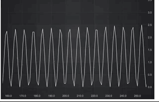

# Zoom Extends to Original Scale Demo

This example showcases how to set the chart to zoom in and out on x axis, and return back to original scale (the visible range before zooming started by mouse wheel) with a double-clicking. For example, the visible x axis range was 100-200 at the very beginning. The chart is dragged to 200-300 and zoomed in to see details. Finally by double-click we return to the original scale which is 200-300 seconds long.

To achieve this behaviour we create CustomMouseWheelZoomModifier which combines both MouseWheel and ZoomExtends chart modifiers.

## Running the Example

Open this folder in terminal and run the following commands:

* `npm install`
* `npm start`

Then visit https://localhost:8080 in your web browser!

