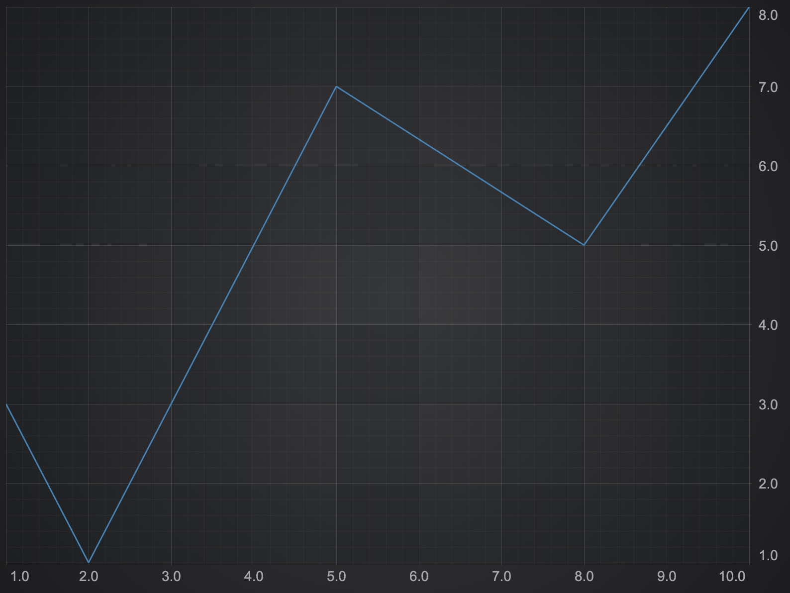

# SciChart.js as a Browser Global Module

## Trial licensing

Ensure you have followed steps from our [getting-started](https://www.scichart.com/getting-started-scichart-js) guide to get a trial!

## How to run project

Please note to use scichart.js you need to have a server to serve html. Just opening a html file will produce an error "Access to XMLHttpRequest from origin 'null' has been blocked by CORS policy". This happens because to load data XMLHttpRequest is used.

To run the project, use:

- `npm install`
- `npm start`



## How to add scichart.browser.js to your project

1. Add script pointing to a specific version into the **head** section of your html file. For instance to add version `2.1.2261` add this script:

```html
<script
  src="https://cdn.jsdelivr.net/npm/scichart@3.3.577/_wasm/scichart.browser.js"
  crossorigin="anonymous"
></script>
```

2. Configure SciChartSurface to download .data and .wasm files from the CDN.

```typescript
SciChart.SciChartSurface.loadWasmFromCDN();
```

If you want to use a different cdn, or serve the wasm files locally you can configure them in detail like this

```typescript
SciChart.SciChartSurface.configure({
  dataUrl: `https://cdn.jsdelivr.net/npm/scichart@3.3.577${SciChart.libraryVersion}/_wasm/scichart2d.data`,
  wasmUrl: `https://cdn.jsdelivr.net/npm/scichart@3.3.577${SciChart.libraryVersion}/_wasm/scichart2d.wasm`,
});
```

3. Create a chart

4. Serve the html file to get this result

# SciChart.js Tutorials and Getting Started

We have a wealth of information on our site showing how to get started with SciChart.js!

Take a look at:

- [Getting-Started with SciChart.js](https://www.scichart.com/getting-started-scichart-js): includes trial licensing, first steps and more
- [Javascript / npm tutorials](https://www.scichart.com/documentation/js/current/Tutorial%2002%20-%20Adding%20Series%20and%20Data.html): using npm, webpack, and scichart.js, create static and dynamic charts with zooming, panning tooltips and more
- [Vanilla Javascript tutorials](https://www.scichart.com/documentation/js/current/Tutorial%2001%20-%20Including%20SciChart.js%20in%20an%20HTML%20Page.html): using only vanilla javascript and HTML,
- [Official scichart.js demos](https://demo.scichart.com): view our demos online! Full github source code also available at [github.com/abtsoftware/scichart.js.examples](https://github.com/abtsoftware/scichart.js.examples)
