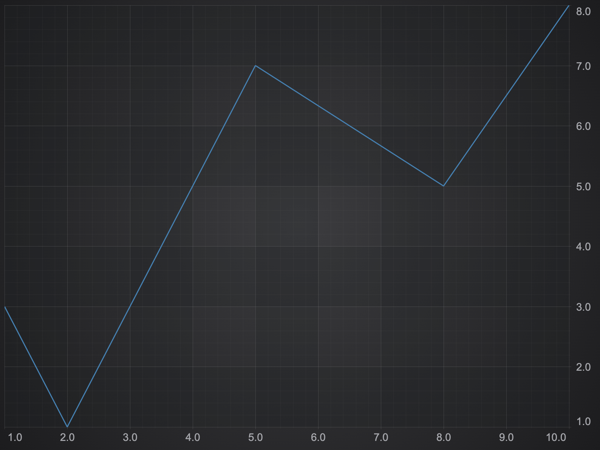

# Simple Chart with Webpack and NPM

This is the simplest project using SciChart.js as npm module and Webpack.

## How to run the project

* `npm install`
* `npm start`



## Description

### webpack.config.js

Use CopyPlugin to copy wasm and data files and serve them by webpack-dev-server. SciChart.js uses WebAssembly and those files **scichart2d.data**, **scichart2d.wasm** must be loaded.

```javascript
const path = require('path');
const CopyPlugin = require("copy-webpack-plugin");

module.exports = {
  mode: 'development',
  entry: "./src/index.js",
  performance: {
    hints: false
  },
  output: {
    path: path.resolve(__dirname, 'build'),
    filename: 'bundle.js',
  },
  plugins: [
    new CopyPlugin({
      patterns: [
        { from: "src/index.html", to: "" },
        { from: "node_modules/scichart/_wasm/scichart2d.data", to: "" },
        { from: "node_modules/scichart/_wasm/scichart2d.wasm", to: "" }
      ]
    })
  ]
};
```

### SciChartSurface.configure

You may need this to configure from where wasm and data files are served, update `src/index.js` file if needed

```javascript
import { SciChartSurface } from "scichart/Charting/Visuals/SciChartSurface";

// call this before SciChartSurface.create()
SciChart.SciChartSurface.configure({ dataUrl: "/custom/scichart2d.data", wasmUrl: "/other/scichart2d.wasm" });
```

### Chart div element

If you call `SciChartSurface.create("scichart-root")` an element with Id "scichart-root" must be present.

```html
<html lang="en-us">
    <head>
        <meta charset="utf-8" />
        <meta content="text/html; charset=utf-8" http-equiv="Content-Type" />
        <title>SciChart.js Tutorial 1</title>
        <script async type="text/javascript" src="bundle.js"></script>
    </head>
    <body>
        <!-- the Div where the SciChartSurface will reside -->
        <div id="scichart-root" style="width: 800px; height: 600px;"></div>
    </body>
</html>
```
