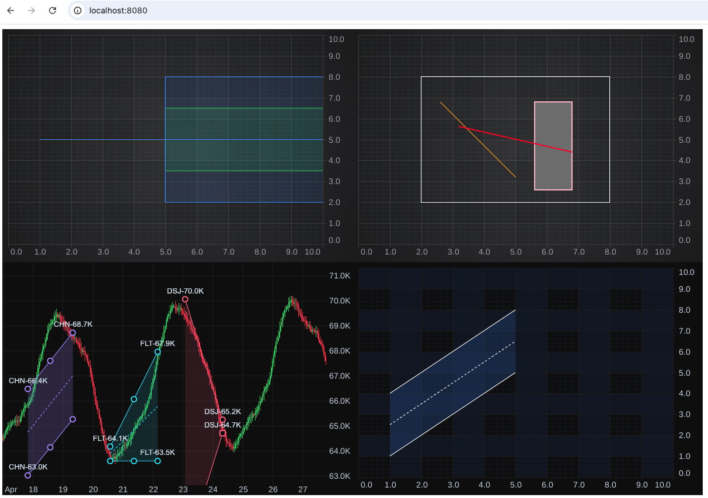

# scichart-financial-tools demo

Standalone SciChart.js Financial Tools examples. It contains simple examples, the best way to start learning `scichart-financial-tools` npm package.

## Run

    npm install
    npm start

Then open http://localhost:8080.

## Build

    npm run build
