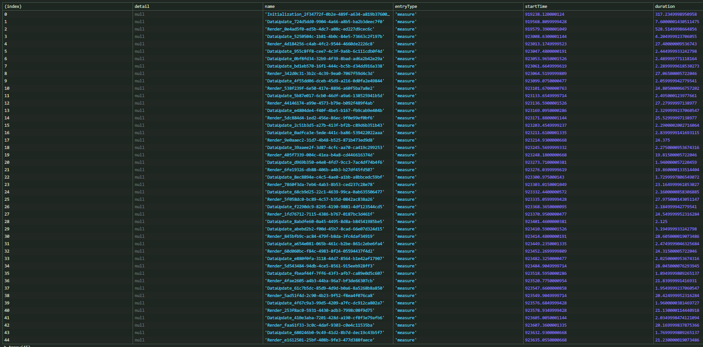

# Performance Optimization Cheat Sheet

There are plenty of performance optimizations SciChart.JS allows to apply.
Some of them are described in https://www.scichart.com/documentation/js/current/webframe.html#Performance%20Tips.html

Additionally, other improvements can be made depending on the use case.

## Multiple Charts

### WebGlContext limitations handling

[Chart WASM context types](https://www.scichart.com/documentation/js/current/webframe.html#SciChartSurface.create%20and%20createSingle.html)

### Replacing Multiple Charts with SubCharts

SubCharts API allows to add multiple chart surfaces within a main one.  
This means all of them will be drawn simultaneously on a single HTML canvas.

This could be beneficial when many surfaces need to be updated at the same time.  
For example, instead of 2 surfaces, you can use a chart with 2 sub-surfaces.

Some limitations that arise are obviously related to the positioning of the surfaces,  
since they could no longer be placed within an arbitrary `div` element on the webpage.

Here we introduce the **SubChart Wrappers** feature that allows to place custom HTML blocks relative to the sub-surface position.
It automatically recalculates sub-surface size to accommodate it between the HTML sections on the sides.

---

This could be used as another API for the relative positioning of any UI elements based on the chart coordinates (DataValue/Pixel/Relative).
Other approaches are using [`CustomAnnotation`s](https://github.com/ABTSoftware/SciChart.JS.Examples/tree/master/Sandbox/CustomerExamples/Annotations) or setting the offsets on elements manually.

---

The drawback of the approach is that everything in a sub-surface would be rerendered whenever any other sub-surface on the chart is.

### Deciding on the approach to take

- You can try different combinations of sub-charts and normal charts.

- define your requirements and consider the limitations of each approach

- consider [the difference between `SciChartSurface.create` and `SciChartSurface.createSingle`](#webglcontext-limitations-handling)

- define which charts should be updated together and which ones could be updated independently;  
  e.g. charts could be bound by synchronized visible range or append new points simultaneously, then this scenario could probably be optimized with the sub-charts

- structure your chart setup in such a way that it is easy to switch between normal surface and sub-surface

- most importantly, measure the performance while testing the different approaches.

---

## Realtime Data

In addition to the related [Performance Tips in documentation](https://www.scichart.com/documentation/js/current/webframe.html#Performance%20Tips.html)

### FIFO

For scenarios where data needs to be added and removed, the FIFO series is an optimal solution.
https://www.scichart.com/documentation/js/current/webframe.html#DataSeries_RealtimeUpdates.html

### Controlling draw requests

[UpdateSuspender API](https://www.scichart.com/documentation/js/current/webframe.html#Batching%20updates%20or%20Temporary%20Suspending%20Drawing.html)

- As specified in the docs above, the chart rendering doesn't happen in an endless event loop but rather as a result of a redraw request

- To create a chart with rendering set on pause set `I2DSurfaceOptions.createSuspended` (or to set this globally - `SciChartDefaults.createSuspended`);

- to dynamically pause rendering use `sciChartSurface.suspendUpdates()`;

- in some cases suspended state may be ignored due to some specific events that force a redraw (e.g. chart is resized, Native Font Loading)

- the rendering could be unpaused with `sciChartSurface.resume()` and to request a redraw - `sciChartSurface.invalidateElement()`

- render promise - [`SciChartSurface.nextStateRender`](https://www.scichart.com/documentation/js/current/typedoc/classes/scichartsurface.html#nextstaterender)

```typescript
// trigger redraw request and wait for it to happen
await sciChartSurface.nextStateRender({
  resumeBefore: true,
  invalidateOnResume: true,
  suspendAfter: false,
});
```

- potentially `nextStateRender` allows controlling the framerate

### Data update logic

Sometimes operations with JS arrays may be slow, so consider applying some optimization techniques when preparing data to be passed to Data Series.

- avoid using metadata on Data Series if possible

- avoid recreating arrays and array resizing. You can reuse arrays and preset their size.  
  Even though this is just a micro-optimization, in some cases it may be important.

  ```typescript
  const result = Array(capacity);
  result[i] = getValue();
  ```

- try using Typed Arrays

## General Improvements

### allowFastMath flag

[axis.allowFastMath](https://www.scichart.com/documentation/js/current/typedoc/interfaces/inumericaxisoptions.html#allowfastmath)
By default SciChart stores data values as 64-bit numbers. Enabling `allowFastMath` will switch to 32-bit mode and potentially could boost the performance by sacrificing the precision.

### Native Text

There are some places where we have 2 options for text drawing mechanisms (currently Chart Title and Axis Labels).

- The default one uses HTML Canvas to create a text texture.
  This approach is pretty compliant with many requirements.
- Native Text is a more powerful API. It may have some visual differences from the Canvas text, but improvements are planned to be implemented.  
  https://www.scichart.com/documentation/js/current/webframe.html#Native%20Text%20Api.html

Set this option before chart initialization to opt in the Native Text usage:

```typescript
SciChartDefaults.useNativeText = true;
```

Also, it could be set individually per axis and title renderer.

```typescript
SciChartSurface.create(rootElement, {
  title: "Chart Title",
  titleStyle: {
    useNativeText: false,
  },
});

const xAxis = new NumericAxis(wasmContext, {
  useNativeText: true,
});
```

w

### Other SciChart features that can affect performance

- grid lines, ticks, and bands position calculation and drawing happen on each render cycle.  
  So if they are not required for a use case consider disabling them per axis for better performance.

- Palette Providers require extra iteration through data points, thus avoid them if possible.  
  For example, use several renderable series with different styles instead.

- Rollover, Cursor, Tooltip, Selection and Hover modifiers as well as HitTest in general may be computationally heavy.  
  It is recommended to exclude the unnecessary targets (renderable series) from the list of objects the detection is applied to.

### Chart initialization improvements

If the time to the first frame rendered on a chart is important,  
there are some improvements that can be made.

First of all, here are the sequential stages that should happen to initialize a surface:

- Surface create method is called (e.g. `SciChartSurface.create`)
- WASM dependencies are fetched via network
- the dependencies are compiled
- a wasmContext is created
- a surface is created

(Refer to info about [multi-charts and createSingle-charts](#webglContext-limitations-handling) regarding some differences.)

Depending on an app's functionality these stages might start executing pretty late after the page load or even on demand,
and will take some time to execute.  
So to shorten this delay we can trigger those stages earlier.  
The surface creation is one of the operations that could be executed as soon as possible, but it still depends on the use case.
So here are other possible improvements.

#### Preload WASM modules

We recommend getting familiarized with the `resource priority` and `preload/prefetch` HTML features.
https://developer.mozilla.org/en-US/docs/Web/HTML/Attributes/rel/preload  
https://developer.mozilla.org/en-US/docs/Web/HTML/Attributes/rel/prefetch

And be aware of the pitfalls they may cause, so be cautious while deciding whether to use this advice.

```html
<link rel="preload" href="scichart2d.wasm" as="fetch" crossorigin="anonymous" />
<link rel="preload" href="scichart2d.data" as="fetch" crossorigin="anonymous" />
<link rel="preload" href="scichart3d.wasm" as="fetch" crossorigin="anonymous" />
<link rel="preload" href="scichart3d.data" as="fetch" crossorigin="anonymous" />
```

#### Precompile WASM and preinitialize SciChart Engine (wasmContext)

```typescript
// Initializes 2D Chart Engine or returns an existing one.
// Also this triggers the fetching of .wasm and .data files
const wasmContext = await getSharedWasmContext();
```

#### Start rendering after the full chart setup

A first render event in SciChart usually is the longest as it includes all of the necessary pre-setup.
Sometimes SciChart can try to start rendering even before anything is added to a surface.
So depending on a use case you may want to control when a render execution occurs (Check API at [Controlling draw requests](#controlling-draw-requests)).

```typescript
// create a surface with disabled rendering
const { sciChartSurface } = await SciChartSurface.create(rootElement, {
  createSuspended: true,
});

// do the required chart configuration, e.g. axes, series, etc.

// enable surface rendering. This will result in the first frame being drawn only after the configuration
await sciChartSurface.nextStateRender({
  resumeBefore: true,
  invalidateOnResume: true,
  suspendAfter: false,
});
```

## Performance measurement

Obviously, it is possible and recommended to do performance profiling via Dev Tools provided by browsers.

Additionally, the lib has utils for providing insights regarding chart rendering behaviour.

### PerformanceDebugHelper

_Note: This functionality is experimental and may undergo changes in the future. It is intended for development use only, and the results should be treated with caution._

The [`PerformanceDebugHelper`](https://www.scichart.com/documentation/js/current/typedoc/classes/performancedebughelper.html) is a helper class which uses the [Performance API](https://developer.mozilla.org/en-US/docs/Web/API/Performance_API).
Its purpose is to provide better insights into the SciChart execution details.

### Performance Debug Mode

The performance debug mode is disabled by default, and could be toggled with `PerformanceDebugHelper.enableDebug`.
When it is enabled SciChart adds internally several checkpoints with `mark` method.
The checkpoints are described with enum [EPerformanceMarkType](https://www.scichart.com/documentation/js/current/typedoc/enums/eperformancemarktype.html).
Marks are provided with `detail` object:

```ts
{
  context: string; // Surface or DataSeries
  relatedId: string; // common ID for the start/end marks pair
}
```

#### Custom performance checkpoints

Additionally, custom checkpoints could be easily added by the same principle:

```typescript
const appendData = () => {
  // operations on JS arrays might be costly thus it is usually worth verifying if they do not create a bottleneck in performance
  const startMark = PerformanceDebugHelper.mark("DataPrepareStart", {
 contextId: sciChartSurface.id,
  });

  const xValues = // ...
  const yValues = // ...

  PerformanceDebugHelper.mark("DataPrepareEnd", {
    relatedId: startMark?.detail?.relatedId,
    contextId: sciChartSurface.id,
  });

  xyDataSeries.appendRange(xValues, yValues);
};
```

#### Performance debug info retrieval

To retrieve and operate over the debug info [use the Performance API directly](https://developer.mozilla.org/en-US/docs/Web/API/Performance_API/User_timing#retrieving_markers_and_measures).
Example of measuring durations of continuous events (Initialization, DataUpdate, Render,...):

```typescript
const allPerformanceMarks = performance.getEntriesByType("mark");

const endMarks = allPerformanceMarks.filter((mark) =>
  mark.name.includes("End")
);
const startMarks = allPerformanceMarks.filter((mark) =>
  mark.name.includes("Start")
);
const startMarksMap = new Map(
  startMarks.map((mark) => [mark.detail.relatedId, mark])
);

const measures = endMarks.reduce((acc, endMark) => {
  const startMark = startMarksMap.get(endMark.detail.relatedId);
  // handling an edge case for some types of marks
  if (!startMark) {
    return acc;
  }

  // measure the period defined by the start/end pair of related marks
  acc.push(
    performance.measure(
      `${endMark.name.split("End")[0]}_${endMark.detail.relatedId}`,
      startMark.name,
      endMark.name
    )
  );

  return acc;
}, []);

console.table(measures);
```

As a result, you can get something like the following:


#### Performance Debugging Overhead and Cleanup

When using the helper and the Performance API, consider that it could affect the execution and add some overhead.  
Also, consider that storing this data affects the application's memory usage.  
Thus, check the [performance entries cleanup section](https://developer.mozilla.org/en-US/docs/Web/API/Performance_API/User_timing#removing_markers_and_measures).
